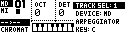
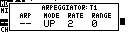
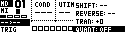

# Arpeggiator Page

The Arpeggiator Page edits the arpeggiator attached to the current sequencer track. MCL 5.00 stores arpeggiator settings with the track when the track is saved to the grid.

Open it from the Chromatic Page Track Menu:

```text
[Global] > ARPEGGIATOR
```



The page returns to the previous page when you press **[Yes/Enter]**, **[No/Exit]** or one of the panel buttons.



## Controls

| Control | Assignment |
| --- | --- |
| Encoder 1 | Arpeggiator state. |
| Encoder 2 | Arpeggiator mode. |
| Encoder 3 | Rate. |
| Encoder 4 | Range in octaves. |
| **[Trig]** / keyboard input | Edit the current note set through the Chromatic Page input handler. |

## Arpeggiator State

| State | Label | Behavior |
| --- | --- | --- |
| Off | `--` | Arpeggiator disabled. |
| On | `ON` | Arpeggiates the current held note set. |
| Latch | `LAT` | Preserves the note set after keys are released. |
| Lock | `LCK` | Locks the current note set so accidental note selection does not replace it. |

`LCK` is new in MCL 5.00 and is useful when performing from the Chromatic Page while keeping an arpeggio pattern fixed.

## Rate

The rate encoder controls how the arpeggiator advances.

| Rate | Behavior |
| --- | --- |
| `TRG` | Advance only when the related sequencer track fires a trig. |
| Numeric values | Advance at the selected clocked rate. |

`TRG` is useful when the arpeggio should follow the rhythm of the sequencer track instead of running continuously.

## Range

Range sets how many octaves the arpeggiator spans above the selected notes.

Higher ranges create wider patterns, while `0` keeps the arpeggio inside the entered note set.

## Modes

| Mode | Label | Notes played in order |
| --- | --- | --- |
| Up | `UP` | Ascending. |
| Down | `DWN` | Descending. |
| Up Down | `UD` | Ascending then descending. |
| Down Up | `DU` | Descending then ascending. |
| Up And Down | `UND` | Ascending and then descending with endpoint behavior distinct from `UD`. |
| Down And Up | `DNU` | Descending and then ascending with endpoint behavior distinct from `DU`. |
| Converge | `CNV` | From the outside notes toward the center. |
| Diverge | `DIV` | From the center notes outward. |
| Converge/Diverge | `CND` | Alternates converging and diverging motion. |
| Pinky Up | `PU` | Ascending with the first note inserted before other notes. |
| Pinky Down | `PD` | Descending with the first note inserted before other notes. |
| Thumb Up | `TU` | Ascending with the last note inserted before other notes. |
| Thumb Down | `TD` | Descending with the last note inserted before other notes. |
| Up Pinky | `UPP` | Ascending with only the first note shifted up an octave. |
| Down Pinky | `DP` | Descending with only the first note shifted up an octave. |
| Up 2nd | `U2` | Ascending with every second note shifted up an octave. |
| Down 2nd | `D2` | Descending with every second note shifted up an octave. |
| Random | `RND` | Static randomized order. |
| Random 2 | `RN2` | New random order over time. |

## Quantization

The Track Menu `QUANT` setting controls whether arpeggiator start timing is quantized or immediate. Access it from the Step Editor or PianoRoll Track Menu by holding **[Global]** and scrolling to `QUANT`.



## Track Mutes And Transport

Arpeggiator playback follows the related track's mute state and resets cleanly when transport starts. If the track is muted, arpeggiated notes are suppressed with the track.
