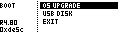

# Boot Menu

The Boot Menu is accessed by holding the MC's **`Page`** button while powering on the MegaCommand or MegaCMD MIDI controller.

| Entry | Function |
| --- | --- |
| OS UPGRADE | Places the MegaCommand in Serial Mode for MCL OS upgrade. |
| USB DISK | MegaCMD/TBD only: turns the controller into a USB Mass Storage device for direct SD card access from the host computer. |
| EXIT | Exit the menu and boot normally. |

AVR MegaCMD builds also include **`DFU MODE`**, which places the USB microcontroller into DFU mode for USB firmware update.
