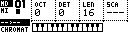

# Chromatic Page

The Chromatic Page plays and records pitched notes for the current sequencer track. It can target the primary device, such as Machinedrum or TBD, or the secondary/external MIDI-style tracks.

Open it from Page Select with:

```text
[Bank Group] + [Trig 8]
```



## Controls

| Control | Assignment |
| --- | --- |
| Encoder 1 | Octave offset (`OCT`). |
| Encoder 2 | Fine tune / detune (`DET`). |
| Encoder 3 | Track length (`LEN`) or poly length (`PLEN`) when a poly group is active. |
| Encoder 4 | Scale (`SCA`). |
| **[Trig]** keys | Play the on-screen keyboard or select tracks while the Track Menu is open. |
| **[Scale]** | Toggle primary/secondary device target where available. |
| **[Global]** | Hold for the Track Menu. |
| **[Rec]** + **[Play]** | Start live recording. |
| Track Menu `CLEAR` | Clear the current track or active poly group where applicable; repeat `CLEAR` to undo while the undo state is active. |

The bottom of the display shows a keyboard view. Played notes and arpeggiator notes are reflected there.

## Parameters

| Parameter | Function |
| --- | --- |
| `OCT` | Moves played notes by octaves. |
| `DET` | Fine tune / detune for the active pitched track where supported. |
| `LEN` | Length of the active sequencer track. |
| `PLEN` | Length shown when the active primary track belongs to a poly group. |
| `SCA` | Musical scale mapping for incoming and trig-key notes. |

The scale setting maps incoming notes to the selected scale. Notes shifted outside the playable range are skipped rather than wrapped into an unexpected low pitch.

## Device Selection

Press **[Scale]** to switch the Chromatic Page between primary and secondary targets where both are available.

| Target | Typical use |
| --- | --- |
| Primary | Machinedrum, TBD or another primary step-capable device. |
| Secondary | External MIDI-style tracks, A4/MNM/generic MIDI or TBD secondary tracks. |

When the Track Menu is open, the trig keys can select or mute secondary tracks.

| Trig keys | Function |
| --- | --- |
| **[Trig 1-6]** | Select external MIDI-style tracks 1-6. |
| **[Trig 9-14]** | Toggle mutes for external MIDI-style tracks 1-6. |

## Track Menu Entries

Hold **[Global]** to open the Track Menu.


| Entry | Function |
| --- | --- |
| `DEVICE` | Select primary or secondary target. |
| `TRACK SEL` | Select the active track. |
| `SPEED` | Set track playback speed. |
| `COPY`, `CLEAR`, `PASTE` | Copy, clear or paste the active track. |
| `SHIFT`, `REVERSE`, `TRAN` | Shift, reverse or transpose the active track. |
| `ARPEGGIATOR` | Open the per-track Arpeggiator Page. |
| `KEY` | Shift the scale root by semitones. |
| `POLYPHONY` | Open the Polyphony Page. |
| `SOUND` | Open sound selection where the primary device supports it. |
| `LENGTH` | Set track length. |
| `CHANNEL` | Set the MIDI channel for secondary/external tracks. |
| `QUANT` | Toggle live record and arpeggiator quantization. |


## Controller Input Setup

Chromatic input is configured from:

```text
CONFIG > MIDI > CONTROLLER > INPUT
```

| Setting | Function |
| --- | --- |
| `PORT` | Selects the controller input port: `2`, `USB`, or `2 + USB`. |
| `CHRO CHAN` | Channel for chromatic playing. Use `--` or `1..16`. |
| `TRIG CHAN` | Channel for external drum-pad triggering of tracks. Use `--` or `1..16`. |
| `POLY MODE` | `INT` uses internal/chromatic input only. `INT+EXT` also lets external controller input play poly voice groups. |

The external MIDI channel used for a poly voice group comes from that group's channel assignment on the Polyphony Page.

## Recording Notes

Start live recording with:

```text
[Rec] + [Play]
```

While recording, played notes are written into the active track or into the selected poly voice tracks. The Track Menu `QUANT` setting controls whether note placement is quantized.

## Machinedrum And TBD Pitch

For Machinedrum-style tracks, the current machine must support pitched playback for chromatic playing to be useful. MIDI machines are handled as MIDI voice tracks. TBD tracks use the note/pitch target exposed by the active TBD sound.

For melodic Machinedrum machines, the track's pitch parameter is mapped to notes. Tonal machine tuning uses the newer equal-temperament-style mapping; default tuning keeps the legacy machine-specific behavior.
