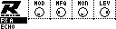
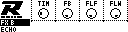

# FX Delay Page

Controls the master FX Delay settings.

_To enter the FX Delay Page: hold **[Bank Group]**, then press **[Trig 13]**._

Each parameter of the MD's delay effect can be controlled. Four are displayed at once on screen. On MD-style controls, hold **[No]** and press **[Left]** to open the Delay/Echo page from either FX page. If Delay/Echo is already visible, the same shortcut switches between its two parameter groups. Release **[No]** to return to the Mixer Page.

## FX A

| Control | Assignment |
| --- | --- |
| Encoder 1 | Modulation (MOD) |
| Encoder 2 | Modulation Frequency (MFQ) |
| Encoder 3 | Mono (MON) |
| Encoder 4 | Level (LEV) |

## FX B

| Control | Assignment |
| --- | --- |
| Encoder 1 | Delay Time (TIM) |
| Encoder 2 | Delay Feedback (FB) |
| Encoder 3 | Filter Frequency (FLF) |
| Encoder 4 | Filter Width (FLW) |

