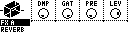
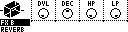

# FX Reverb Page

Controls the master FX Reverb settings.

_To enter the FX Reverb Page: hold **[Bank Group]**, then press **[Trig 14]**._

Each parameter of the MD's reverb effect can be controlled. Four are displayed at once on screen. On MD-style controls, hold **[No]** and press **[Down]** to open the Reverb page from either FX page. If Reverb is already visible, the same shortcut switches between its two parameter groups. Release **[No]** to return to the Mixer Page.

## FX A

| Control | Assignment |
| --- | --- |
| Encoder 1 | Damping (DMP) |
| Encoder 2 | Gating (GAT) |
| Encoder 3 | Pre-delay (PRE) |
| Encoder 4 | Level (LEV) |

## FX B

| Control | Assignment |
| --- | --- |
| Encoder 1 | Decay Level (DVL) |
| Encoder 2 | Decay (DEC) |
| Encoder 3 | Low Pass Filter (HP) |
| Encoder 4 | High Pass Filter (LP) |

