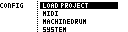
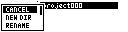
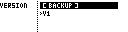
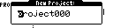
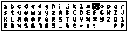

# Project and Configuration Menu

The Configuration menu is used for project management and global or per-project settings.

Open it from the Grid Page with:

```text
[Bank Group], then [Pattern/Song]
```

Use **[Up]** and **[Down]** to move through entries, **[Yes/Enter]** to select, and **[No/Exit]** to leave a menu.

## Top-Level Entries

The top-level menu is named `CONFIG`.



| Entry | Function |
| --- | --- |
| `LOAD PROJECT` | Opens the project browser. |
| `MIDI` | Opens device, port, sync, routing, controller and program-change settings. |
| Device config entries | Dynamic entries for connected devices, such as Machinedrum, Monomachine, Analog Four, generic MIDI or TBD. |
| `SYSTEM` | Opens display, project-configuration and grid-encoder settings. |

The device config entries are dynamic. In older documentation these appeared as fixed entries such as `DRIVER 1` and `DRIVER 2`; they are now named for the connected device where possible.

## Project Browser

`LOAD PROJECT` opens the project browser. Projects can be grouped and nested in folders on the SD card.


The project browser can show:

| Entry type | Meaning |
| --- | --- |
| `[ NEW PROJECT ]` | Create a new project in the current folder. |
| `..` | Move to the parent folder. |
| Folder | Open the folder. |
| Project | Load the project. |

The currently loaded project is marked in the browser.

Browser shortcuts: **[Left]** jumps to the top of the current project list. **[Right]** returns to the project root and focuses the currently loaded project path.

## File Menu

Hold **[Global]** from the project browser to open the file menu.



| Entry | Function |
| --- | --- |
| `CANCEL` | Close the file menu without action. |
| `NEW DIR` | Create a folder in the current location. |
| `RENAME` | Rename the selected project or folder where allowed. |
| `MOVE` | Move the selected project or folder to another folder. |
| `CLONE` | Duplicate the selected project or folder. |
| `VERS` | Open project versions for the selected project. |
| `DELETE` | Delete the selected project or folder where allowed. |

The available actions depend on the selected entry and platform.

## Project Versions

The `VERS` action opens the project version browser. Versions are snapshots of the same project, useful before major edits or before converting an older project.



Typical version actions:

| Action | Function |
| --- | --- |
| `BACKUP` | Create a new version snapshot, load that new version immediately, and return to the Grid Page. |
| Load version | Restore the selected project version and return to the Grid Page. |
| Delete version | Remove a non-active backup version. The base version cannot be deleted. |

## New Project

Creating a project opens a text-entry page. If a project or directory with the same name already exists, MCL reports an error instead of overwriting it.





## Project Files

Projects are stored on the SD card with a project master file and grid files. Project and grid headers are versioned so older projects can be upgraded safely.

Back up projects before upgrading firmware. Supported older projects are upgraded when they are first loaded, and upgraded projects are not intended to be opened by older firmware.

Do not edit project files by hand. Use the project browser, file menu and version browser from MCL.

## Saving Projects

MCL writes to the current project's data files when you save slots or groups from the Save Page. After that, there is no separate full-project save step.

System settings can be used globally or recalled with each project. `SYSTEM > PROJ CFG` controls this: `OFF` keeps the current global setup when loading projects, and `ON` applies the configuration saved with the project.
