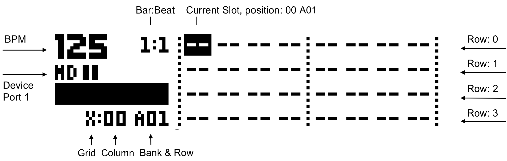
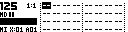

# Grid Page

The Grid Page is the main working page in MCL. It shows the project grid, supports movement between rows and slots, and opens the Save, Load and Slot Menu workflows.

## Screen Layout

The page shows a window into the active grid.

The annotated image above labels the grid regions. A current empty-project capture looks like this:

| Display item | Meaning |
| --- | --- |
| Slot labels | The stored track or state type, such as a drum model, device track, performance state or empty slot. |
| Inverted cursor | The selected slot. |
| Grid marker | Whether Grid X or Grid Y is active. |
| Bank/row position | The current row within banks A-H. |
| Row name | The stored row name when one exists. |
| Queued/active markings | Slots involved in queue or active loading may be drawn differently. |

Empty slots are shown as empty or placeholder cells.

## Basic Controls

| Control | Assignment |
| --- | --- |
| Encoder 1 | Move horizontally through columns. |
| Encoder 2 | Move vertically through rows. |
| Encoder 3 | Selection width when the Slot Menu is open. |
| Encoder 4 | Selection height when the Slot Menu is open. |
| **[Left]** / **[Right]** | Move across columns. |
| **[Up]** / **[Down]** | Move across rows. |
| **[Scale]** | Toggle Grid X / Grid Y. |
| **[Yes/Enter]** | Open Load. |
| **[Function]** + **[Yes/Enter]** | Open Save. |
| **[No/Exit]** | Hold to open the Slot Menu. |
| **[Bank]** + **[Trig]** | Load or queue rows by bank position. |

On TBD, Save and Load keep the Grid Page visible rather than replacing the whole page.

## Active Grid

The active grid selects which 16-column grid is targeted. The OLED shows a scrolling 8-column window into that grid.

| Active grid | Action target |
| --- | --- |
| Grid X | The primary configured device. |
| Grid Y | The secondary configured device or auxiliary state area. |

Use **[Scale]** to toggle grids. Save, load, slot editing and range selection apply to the grid currently shown unless the workflow explicitly selects both grids or a group.

## Opening Save And Load

| Action | Result |
| --- | --- |
| **[Function]** + **[Yes/Enter]** | Opens Save. |
| **[Yes/Enter]** | Opens Load. |
| **[No/Exit]** held, then **[Yes/Enter]** | Loads the selected Slot Menu range from the grid page. |

Save and Load can act on individual slots or on groups. Group selection is described in the Save and Load pages.

## Opening The Slot Menu

Hold **[No/Exit]** from the Grid Page to open the Slot Menu.

While the Slot Menu is open, the arrows or encoders can expand the selected rectangle. Releasing **[No/Exit]** applies edits such as length, loops, jump row or sequence-only loading. Dedicated clear/copy/paste keys can also apply slot edit actions.

## Row Loading From Bank And Trig Keys

The Machinedrum-style **[Bank]** + **[Trig]** gesture treats grid rows like patterns.

| Gesture | Result |
| --- | --- |
| Select one bank/trig row | Load that row using the active group selection. |
| Select multiple trig rows | Queue those rows as a chain. |

This is the fastest performance workflow for row-level loading.

## Grid Encoder Mode

`CONFIG > SYSTEM > GRID ENCOD` can change the Grid Page encoders.

| Value | Behavior |
| --- | --- |
| `--` | Encoders navigate the grid normally. |
| `PERF` | Encoders act as performance controllers from the Grid Page. |

When using `PERF`, use arrow keys and shortcuts for grid navigation.
