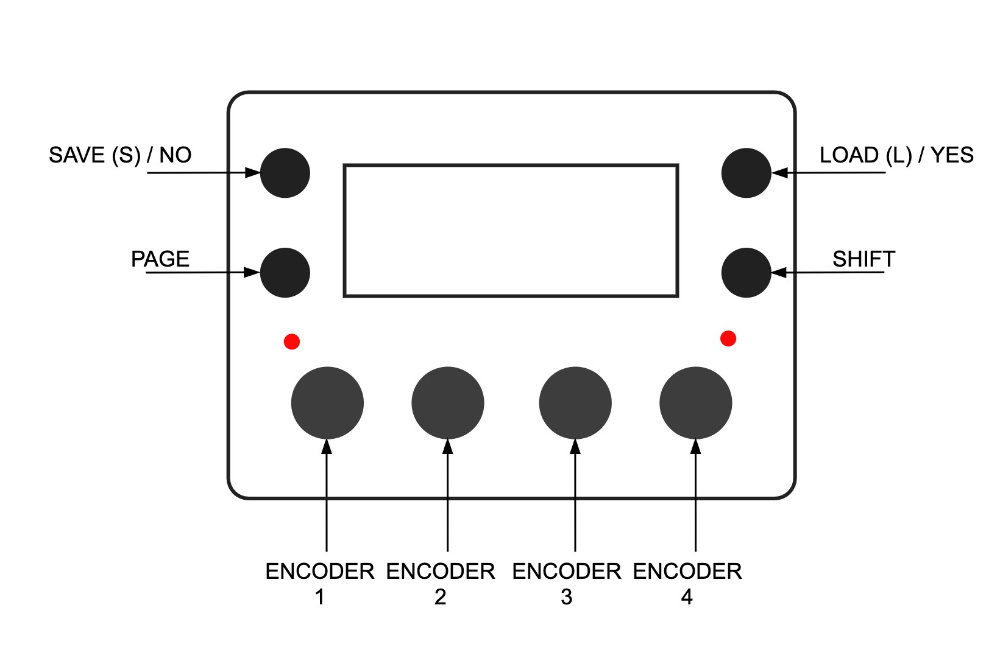
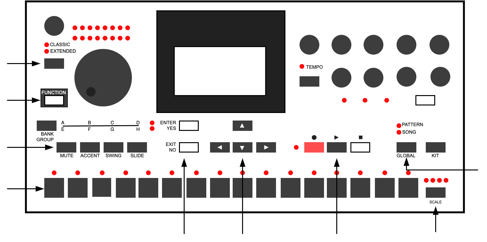
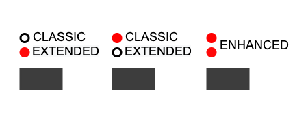

# GUI

## Function Buttons

From the Grid Page the MC's function buttons perform the following actions:

**`Save | No`**: Enters the Save Page.
**`Load | Yes`**: Enters the Load page.
**`Page`**: Enters the PageSelect page.
**`Shift | Menu`**: Opens the slot Menu.

Combined Button Presses:

**`Save | No` + `Load | Yes`**: Opens the MCL Configuration menu.

## Encoder Buttons

Encoder buttons can increase rotation speed for coarse edits. The exact multiplier depends on the page and control.

On MD and TBD-16, arrow keys can select and edit visible MCL page parameters on most pages.

## Machinedrum GUI: Enhanced Mode

The MDX firmware introduces a third editing mode beyond Classic and Extended termed **Enhanced Mode**.

Enhanced mode is activated automatically when the MD is connected to the MegaCommand.

When in Enhanced mode, both Classic and Extended LEDs will be lit.

With the sequencer stopped, hold down the MD's **[Classic/Extended]** key for 1.5 seconds to switch between Enhanced and Classic/Extended modes.

Enhanced mode disables editing access to the MD's internal sequencer and enables the Machinedrum's GUI to be fully integrated with MCL.

## MD + MCL command summary

**General**

- **[Classic/Extended]** toggle between Classic, Extended and Enhanced Modes.
(When in Enhanced mode, the sequencer must be stopped to switch modes.)
- **[Function] + [Bank Group]** toggle Bank Group selection.
- **[Rec]** Enter Step edit mode.
- **[Global]** Open the current Page's shift menu.
- **[Global] + [Up/Down/Left/Right]** Navigate the shift menu.
- **[Bank Group]** Hold to Open the Page Select menu.
- **[Bank Group] + [Trig]** MCL Page Select.
- **[Bank Group] + [Global]** MCL Config Menu.
- **[Bank Group] + [Exit/No]** Return to Grid page
- **[Function] + [Encoder]** Simultaneously modify parameters across all tracks.
- **[Function] + [Classic/Extended]** Simultaneously reset parameters to last load value across all tracks.

**Loading**

- **[Bank] + [Trig]** loads slots from the selected row according to Group selection.
- **[Bank] + [Multiple Trigs]** creates a chain of slots from selected rows according to Group selection.

**Grid Page**

- **[Up/Down/Left/Right]** position grid cursor.
- **[Function] + [Up/Down/Left/Right]** grid cursor position fast travel.
- **[Scale]** Toggle active grid X or Y.
- **[Function] + [Clear/Copy/Paste]** Clear/Copy/Paste the MD tracks, EXT MIDI tracks and Machinedrum master FX currently loaded in the sequencer.
- Hold **[Exit/No]** key to open Slot Menu.

- **[Bank A,B,C]** keys can be used to select load mode: MAN, AUT, QUE.
- **[Up/Down/Left/Right]** to select multiple slots in the grid.
- **[Clear/Copy/Paste]** to clear/copy/paste selected slot(s).
- **[Enter/Yes]** load selected slots. Slots are loaded according to the current load MODE setting. If more than one row is selected, the MODE is automatically set to QUE, and the loaded slots are added to each column's playback queue.

**[Enter/Yes]** opens **Load Page**

- Hold **[Enter/Yes]** to open slot Group Select. Release **[Enter/Yes]** to load by group. Group selection is editable via **[Trig]** keys 1-5.
- **[Trig]** keys are used to select and load sequencer tracks from slots of the current row.
- **[Bank]** keys can be used to quickly select the load mode: MAN, AUT, QUE.
- **[Function]** to specify a destination track offset for the next load.

**[Function] + [Enter/Yes]** opens **Save Page**

- Hold **[Enter/Yes]** to open slot Group Select. Release **[Enter/Yes]** to save by group. Group selection editable via **[Trig]** keys 1-5.
- **[Trig]** keys are used to select and save individual sequencer tracks to slots of the current row. If none are selected entire row (pattern) will be saved.

**Mixer Page**

- **[Classic/Extended]** Open/Close the Mixer Page.
- **[Classic/Extended]** + **[Trig]** Mute/Unmute selected track(s).
- **[Scale]** Switch Grid X Y tracks.
- **[Trig]** Select track
- **[Trigs] + [Encoder]** Simultaneously modify parameters across selected tracks.
- **[Trigs] + [Classic/Extended]** Simultaneously reset parameters to last load value across selected tracks.
- **[Trig]** + **[Enter/Yes]** Mute/Unmute selected track(s).
- **[Trig]** + **[Exit/No]** Solo selected track(s).
- **[Function]** + **[Enter/Yes]** Flip active mutes.
- **[Up/Down/Left/Right]** Preview and edit Performance Sets.
- **[Up/Down/Left/Right]** + **[Enter/Yes]** Load selected Performance Set.
- **[Up/Down/Left/Right]** + **[Mute/BankA]** Disable active device's mutes from selected Performance Set.
- **[Up/Down/Left/Right]** + **[Swing/BankB]** Set selected Performance Set to load automatically with PF Slot in Grid Y.
- **`Encoders1-4`** Performance Controllers (A,B,C,D) scene morphs.
- Hold a Perf encoder button + **[Global]** / **[Shift/Menu]** to clear both assigned scenes for that controller.
- Hold a Perf encoder button + **[Load/Yes]** to autofill that controller's right scene from changed kit parameters.
- **[Up/Down/Left/Right] + [Exit/No] + `Encoders1-4`** Set performance controller lock to mute set.
- **[Function] + `Encoders1-4`** Hard pan performance controller left or right.
- **[Trig]** + **[Global]** Sequencer mute record for selected tracks.
- **[Trig]** + **[Kit]** Clear sequencer mute record for selected tracks
- **[Global]** + **[Kit]** Clear all active sequencer mute recordings.
- **[Exit/No] + [Left]** Toggle DELAY pages.
- **[Exit/No] + [Down]** Toggle REVERB pages.

**Performance Page**

- **[Global]** Open Performance menu.
- **[Global] + [Trig1-4]** Select active controller 1-4.
- **[Left] + [Trig1-8]** Set active controller LEFT scene 1-8.
- **[Right] + [Trig1-8]** Set active controller RIGHT scene 1-8.
- **[Trig] + [MD Encoder] Or Ext Midi Controller** Assign lock to scene.
- **[Trig] + [Clear/Copy/Paste]**Clear, Copy, Paste scenes (repeat to UNDO).
- **[Trig] + [Enter/Yes]** Scene preview.
- **[Trig] + [Up/Down]** View and edit 16 active scene locks.

**Route Page:**

- **[Trigs]**Toggle between Main output (--) and selected Route output on chosen tracks.
- **`Encoder 1`** Set Route output (C/D/E/F).
- **`Encoder 2`** Set quantize amount.

**Step Editor**

- **[Record]** enter/exit MCL step editing.
- **[Record] + [Play]** enter realtime record mode (from any page).
- **[Function/Scale/Trig] + [Clear/Copy/Paste]** clear/copy/paste for track/page/step.
- **[Step] + [Left/Right]** microtiming.
- **[Step] + [Up/Down]** conditionals.
- **[Step] + [Exit/No]** Mute/unmute step.
- **[Function] + [Left/Right]** shift track sequence left or right.
- **[Function] + [Up]** reverse track sequence.
- Hold **[Global]** to open the Track Menu for `SPEED` and `LENGTH`.
- **[Function] + [Bank B]** edit Step Mute toggle.
- **[Function] + [Bank C]** edit Swing toggle.
- **[Function] + [Bank D]** edit Slide toggle.

**LFO Page**

- Use the LFO setup page to switch LFO mode (`FRE`, `TRG`, `1SH`, `TRK`).
- **[Trigs]** Enter LFO resets (`TRG` and `1SH` modes only).
- **[Scale]** Move between trigger-mask pages in `TRG` and `1SH` modes.
- MCL **[Load/Yes]** / panel button 4 cycles LFO subpages.
- **[Enter/Yes]** LFO On/Off.
- **`Encoder 1`** LFO shape.

**Pianoroll Editor**

- **[Enter/Yes]** Add or remove notes/cc.
- **[Left/Right]** Move cursor along time axis.
- **[Enter/Yes] + [Left/Right]** Nudge cursor along time axis (fine control).
- **[Exit/No] + [Left/Right]** Adjust cursor width.
- **[Enter/Yes] + [Exit/No] + [Left/Right]** Nudge cursor width (fine control).
- **[Up/Down]** Move cursor along note axis.
- **[Enter/Yes] + [Exit/No] + [Up/Down]** Zoom in and out.
- **[Function] + [Up/Down/Left/Right]** Cursor fast travel.
- **[Clear/Copy/Paste]** Clear/copy/paste for track.
- **[Scale]** Toggle sequencer page.
- Hold **[Global]** to open the Track Menu for `SPEED` and `LENGTH`.
- **[Trigs]** Position the cursor at step intervals relative to the current page.
- **[Global]** hold to open Track configuration menu.
- **[Global] + [Trigs]** Access to EXT track select (1-6) and EXT track mutes (9-14).

**Chromatic Page**

- **[Global]**Toggle shift menu for access to Arpeggiator, Poly tracks etc
- **[Function]** + **[Clear/Copy/Paste]** Clear/copy/paste track.
- **[Left/Right]** Move focus between `OCT`, `DET`, `LEN`/`PLEN` and `SCA`.
- **[Up/Down]** Adjust the focused parameter. To transpose the scale root, hold **[Global]** and use Track Menu `KEY`.
- **[Scale]** Switch input device MD/Midi .
- **`Encoder 1`** Octave.
- **`Encoder 2`** Detune.
- **`Encoder 3`** Track length.
- **`Encoder 4`** Scale type.

**Sample Manager Page**

- **[Up/Down]**Navigate menu
- **[Enter/Yes]** Enter a folder, start receive, or send the selected sample to a Machinedrum sample slot.
- **[Exit/No]** Exit/back/cancel.
- **[Global]**File options menu (New directory/rename/delete).

**WAV Designer**

- **[Global] + [Left/Right]**Shift menu select OSC1-3 and Mixer pages.
- **[Left/Right]** Pitch, note increments.
- **[Up/Down]** Fine tune.
- **[Exit/No]**Display corresponding frequency.
- **`Encoder 3`** Pulsewidth for TRI, PUL and SAW.
- **[Trigs] + `Encoder 4`** SIN add overtones/USR modify sample values.
- Mixer Page:
-

- **`Encoder 1`** OSC1 Level.
- **`Encoder 2`** OSC2 Level.
- **`Encoder 3`** OSC3 Level.
- **[Global]** Oscillator mixer page menu for TRANSFER.

**FX Delay Page**

- **[Exit/No] + [Left]** Select Delay/Echo or switch its parameter group.
- **`Encoders 1-4`** FX parameters.

**FX Reverb Page**

- **[Exit/No] + [Down]** Select Reverb or switch its parameter group.
- **`Encoders 1-4`** FX parameters.

**RAM Machines**

- MD **[Yes]** / MCL **[Save/No]** Queue RAM recording.
- MD **[No]** / MCL **[Load/Yes]** Queue RAM playback or apply normal slicing.
- **[Global]** Apply dice slicing.
- **`Encoder 1`** Choose recording source.
- **`Encoder 2`** Dice mode.
- **`Encoder 3`** Slice amount.
- **`Encoder 4`** Record/playback length in sequencer steps.
