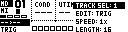

# Sequencer Pages

Sequencer pages are the editing views for tracks stored in the grid. They share track selection, live recording, copy/paste and the Track Menu.

Open sequencer pages from Page Select with **[Bank Group]**.

| Page | Use |
| --- | --- |
| Step Editor | Primary step tracks: Machinedrum, TBD or other step-capable primary devices. |
| PianoRoll Editor | External MIDI-style note and automation tracks. |
| Chromatic Page | Live pitch input, note recording and arpeggiator control. |
| Polyphony Page | Machinedrum voice grouping and multi-timbral chromatic setup. |
| Arpeggiator Page | Per-track arpeggiator settings. |
| LFO Page | Per-track LFO settings. |

## Track Selection

Hold **[Global]** to open the Track Menu, then use `TRACK SEL` to choose the current track.

Other selection shortcuts:

| Context | Shortcut |
| --- | --- |
| Step Editor with Machinedrum | The current MCL track follows the selected Machinedrum track when track-follow is enabled. |
| Step Editor menu open | Press a trig key to select the matching primary track. |
| Chromatic or PianoRoll | Incoming MIDI can select the first external track using the same configured channel. |
| Chromatic or PianoRoll menu open | Press **[Trig 1-6]** to select an external MIDI track. |

When Grid X and Grid Y point at different devices, the sequencer pages track whether the current target is the primary or secondary device.

## Live Record

Start live recording with:

```text
[Rec] + [Play]
```

Depending on the active page, live record can capture:

- step trigs
- notes played in Chromatic or PianoRoll
- parameter changes and MIDI automation
- pitch bend and pressure data on external MIDI-style tracks
- mute-record behavior where supported by the current track engine

Press **[Rec]** again to leave live record and return to editing.

## Track Expansion

When a track length is extended and the new area is empty, MCL can repeat the existing sequence into the added space. This keeps a short pattern musical when expanding from, for example, 16 to 32 or 64 steps.

## Track Menu

Hold **[Global]** from a sequencer page to open the Track Menu. Release **[Global]** to apply the selected menu entry.

The exact entries depend on the page and track type.



| Entry | Function |
| --- | --- |
| `TRACK SEL` | Select the active track. |
| `DEVICE` | Select primary or secondary sequencer device where both are available. |
| `EDIT` | Select the page's edit mode or mask. |
| `SPEED` | Set track speed: `1x`, `2x`, `3/2x`, `3/4x`, `1/2x`, `1/4x`, `1/8x`. |
| `LENGTH` | Set track length. Primary step tracks use up to 64 steps; external MIDI-style tracks use up to 128 steps. |
| `SWING` | Set per-track swing percentage for step tracks. Hold **[Yes/Load]** while applying to update all compatible tracks. |
| `COPY` | Copy the current track or all compatible tracks. |
| `CLEAR` | Clear the current track or all compatible tracks. |
| `PASTE` | Paste copied track data. |
| `SHIFT` | Shift the current track left/right, or shift all compatible tracks. |
| `REVERSE` | Reverse the current track or all compatible tracks. |
| `TRAN` | Transpose the current track or all compatible tracks. |
| `QUANT` | Toggle live record and arpeggiator quantization. |

## Step-Track Menu Entries

Step-capable primary tracks add these entries:

| Entry | Function |
| --- | --- |
| `EDIT` | Select `TRIG`, `MUTE`, `SWING` or `SLIDE` mask. |
| `SOUND` | Open the sound browser where the active device supports kit/sound storage. |
| `ARPEGGIATOR` | Open the per-track arpeggiator page. |
| `LFO MULT` | Set the per-track LFO speed multiplier from `.01` to `8x`. |

## External MIDI Menu Entries

PianoRoll and external MIDI-style tracks add note and automation entries.

| Entry | Function |
| --- | --- |
| `CHANNEL` | Set the MIDI channel for the current track. |
| `VEL` | Set default note velocity. |
| `COND` | Set default trig/note condition. |
| `CC` / parameter select | Choose the active automation lane. |
| `SLIDE` | Enable glide between automation values where supported. |
| `CC REC` | Enable recording of incoming control changes into automation lanes. |

Automation lanes can target CC, NRPN, RPN, pitch bend, channel pressure, poly pressure and program change where supported by the track type.

## Copy, Clear And Paste Scopes

Sequencer pages use three common scopes:

| Scope | How it is used |
| --- | --- |
| Step/event | Hold or select a step/event, then use **[Copy]**, **[Clear]** or **[Paste]**. |
| Page | Hold **[Scale]** with **[Copy]**, **[Clear]** or **[Paste]** to act on the visible page. |
| Track/all | Use Track Menu `COPY`, `CLEAR` and `PASTE` entries for track-level operations. |

Copy/paste carries the data that belongs to the edited page: step data on Step Editor, notes on PianoRoll note mode, and lock/automation data on automation pages.
