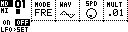
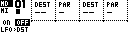
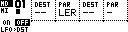
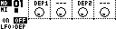

# LFO Page

The LFO Page edits the LFO attached to the current sequencer track. In MCL 5.00, LFO data is stored per track when the track is saved to the grid.

Open it from Page Select with:

```text
[Bank Group] + [Trig 6]
```


The legacy `LF` auxiliary slot is no longer the main LFO storage model. Older project data is migrated where supported, with legacy LFO data copied to the Grid X Track 1 LFO.

## Modulation Targets

Each track LFO has two modulation outputs.

| Destination type | Examples |
| --- | --- |
| Device parameters | Machinedrum, TBD or supported secondary-device parameters. |
| Performance controllers | `PF1` through `PF4`. |
| Other LFO tracks | LFO speed, depth 1 or depth 2. |
| External MIDI targets | Supported generic MIDI, A4, MNM or TBD secondary-device parameters. |

The available destinations follow the current Grid X / Grid Y device configuration.

## Controls

| Control | Assignment |
| --- | --- |
| **[Load/Yes]** / panel button 4 | Cycle LFO subpages. |
| **[Save/No]** / panel button 1 | Toggle the current LFO on or off. |
| **[Global]** | Hold for the Track Menu. |
| **[Function]** + **[Copy]** | Copy the current LFO track. |
| **[Function]** + **[Clear]** | Clear the current LFO track; repeat to undo the clear. |
| **[Function]** + **[Paste]** | Paste the copied LFO track. |
| **[Scale]** | In trigger-mask modes, move between 16-step mask pages. |
| **[Trig]** | In `TRG` or `1SH` mode, edit the LFO reset mask. |

When using MD-style control input, **[Yes/Enter]** also toggles the LFO on/off.

## Subpages

The LFO Page cycles through three subpages.



| Subpage | Encoders | Purpose |
| --- | --- | --- |
| `LFO>DST` | Destination 1, parameter 1, destination 2, parameter 2. | Choose what the two LFO outputs modulate. |
| `LFO>SET` | Mode, waveform, speed, multiplier. | Choose how the LFO runs. |
| `LFO>DEP` | Depth 1, offset/value 1, depth 2, offset/value 2. | Set modulation amount and base values. |

Arrow keys move encoder focus on builds that support focused encoder editing.

## Destination And Learn

On `LFO>DST`, each output chooses a destination and parameter.



| Field | Meaning |
| --- | --- |
| `DEST` | Target track, performance controller, LFO track or device parameter group. |
| `PAR` | Parameter within the selected destination. |
| `---` | No destination. |
| `LER` | Learn a destination/parameter from incoming or edited control data where supported. |

Learning is useful when manual parameter-number browsing is undesirable. Set the destination empty and `PAR` to `LER`, then move the target parameter.



## Mode

The `LFO>SET` mode field uses these labels:

| Mode | Behavior |
| --- | --- |
| `FRE` | Free-running LFO. |
| `TRG` | Reset from the LFO trigger mask. |
| `1SH` | One-shot reset from the trigger mask; the LFO runs through one cycle. |
| `TRK` | Reset when the related sequencer track fires a trig. |

In `TRG` and `1SH` modes, the trig keys edit the reset mask. The mask is shown as 16-step pages and follows the LFO track length.

## Waveforms

The LFO engine includes the current MDX-style shapes:

| Shape family | Examples |
| --- | --- |
| Centered waves | Triangle, saw, square/pulse, random, sine. |
| Ramps | Linear and exponential ramps, plus reverse linear and reverse exponential. |
| Step shapes | Step and linear-linear shapes. |

The page draws a small waveform preview with a centerline where appropriate.

## Speed And Multiplier

`SPD` sets the base LFO speed. `MULT` scales that speed.

| Multiplier | Meaning |
| --- | --- |
| `.01` | One-hundredth speed. |
| `.1` | One-tenth speed. |
| `.25` | Quarter speed. |
| `.5` | Half speed. |
| `1x` | Normal speed. |
| `2x`, `4x`, `8x` | Faster speeds. |

LFO speed can also be a modulation target, so one LFO can modulate another LFO's speed.

## Depth And Offset

On `LFO>DEP`, each output has a depth and an offset/base value.



| Field | Meaning |
| --- | --- |
| `DEP1`, `DEP2` | Modulation depth for output 1 or output 2. |
| Value knobs | Base/offset value for the destination parameter. |

For centered waves, depth moves above and below the offset. For unipolar ramp-style waves, MCL keeps the modulation in the valid 0-127 parameter range.

When a destination parameter changes externally and matches the LFO target, MCL can refresh the offset so modulation continues around the current value.

## Track Menu

The LFO Page uses a small Track Menu:

| Entry | Function |
| --- | --- |
| `TRACK SEL` | Select the track whose LFO is being edited. |
| `DEVICE` | Select primary or secondary device where available. |
| `SPEED` | Set the LFO track's sequencer speed. |
| `LENGTH` | Set the LFO trigger-mask length, up to 64 steps. |

LFO data follows the selected track and is saved when that track is saved to the grid.
