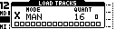
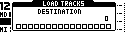

# Load Page

The Load Page loads grid slots into the active tracks or destination slots.

Open it from the Grid Page with:

```text
[Yes/Enter]
```



On TBD, Load appears as a Grid Page overlay. On MegaCommand and MegaCMD, it opens as a page.

## What Load Does

Loading a slot can restore:

- sequence data
- sound or device state, if `SOUND` is enabled for the slot
- length, loop and jump settings
- page-specific state for performance, route, auxiliary and tempo groups

Use the Slot Menu `SOUND` option to make a slot load sequence-only.

## Controls

| Control | Assignment |
| --- | --- |
| Encoder 1 | Load mode: `MAN`, `AUT`, `QUE`. |
| Encoder 2 | Queue length override, active only in Queue mode. |
| Encoder 4 | Load quantization. |
| **[Trig]** keys | Select slots to load. |
| **[Scale]** | Toggle Grid X / Grid Y while selecting. |
| **[Function]** | In Manual mode, select a destination offset. |
| **[Yes/Enter]** | Hold to open group selection; release to load selected groups. |
| **[No/Exit]** | Cancel Load. |
| **[Bank A/B/C]** | Shortcut to Manual, Auto or Queue mode. |

## Loading Individual Slots

1. Open Load.
2. Select one or more slots with the **[Trig]** keys.
3. Release the selection to queue or perform the load according to the active load mode.

The visible grid determines which grid the trig keys target. Use **[Scale]** to switch grids while building a selection.

## Group Load

Hold **[Yes/Enter]** from Load to open `LOAD GROUPS`.


| Group | Loads |
| --- | --- |
| 1 | Primary device group. |
| 2 | Secondary device group. |
| 3 | Performance state group. |
| 4 | Auxiliary or route state group. |
| 5 | Tempo/clock state group. |

Use **[Trig 1-5]** to toggle the desired groups, then release **[Yes/Enter]** to load them from the current row.

Group selection is also used by bank/trig row loading and program-change row loading.

## Load Modes

| Mode | Behavior |
| --- | --- |
| `MAN` | Load the selected slots at the next transition interval. Existing queues for matching slots are cleared. |
| `AUT` | Load the selected slots, then follow each slot's `LOOP` and `JUMP` settings when its loop count is reached. |
| `QUE` | Add the selected row or slot to that column's queue. Queued entries repeat in order. |

Each slot/column has its own chain state. This allows one track to follow an automatic chain, another to play a queued set of rows, and another to remain static.

## Queue Length Override

In Queue mode, Encoder 2 sets a length override.

| Value | Behavior |
| --- | --- |
| `-` / 1 | Use the stored slot length. |
| 2-64 | Override the queued length. |

This is useful when a short track should loop for a longer phrase, or when a group of slots should advance together despite having different stored lengths.

## Quantization

Load quantization sets the transition interval for the selected load.

| Value | Meaning |
| --- | --- |
| `-` / 1 | Use the next available transition. |
| 2, 4, 8, 16, 32, 64 | Wait for the matching step interval before loading. |

Use quantization to keep manual, auto and queue loads aligned with the phrase length.

## Destination Offset

In Manual mode, hold **[Function]** from Load to choose a destination offset.



1. Hold **[Function]**.
2. Press a **[Trig]** key to choose the destination slot.
3. Release the selection to load the selected source slot or range into the chosen destination area.

Destination offset is ignored outside Manual mode.

## Bank And Trig Row Loading

From the Grid Page, **[Bank]** + **[Trig]** loads rows by bank position.

| Gesture | Result |
| --- | --- |
| One row selected | Load that row using the current load mode and group selection. |
| Multiple rows selected | Queue the selected rows as a row chain. |

If no row is already queued, selecting a row jumps to or loads that row. If rows are already selected, additional rows are added in Queue mode.

## Track Levels During Load

For Machinedrum tracks, MCL does not continuously transmit track `LEV` while the sequencer is running. This lets the performer use the Machinedrum level control for live fades during and after slot loads.

Use `CONFIG > Machinedrum > NORMALIZE` to keep saved track loudness predictable when loading between slots.
