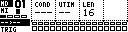
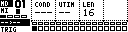
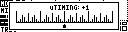
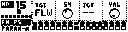

# Step Editor Page

The Step Editor programs primary step tracks. On classic MegaCommand this is the Machinedrum step sequencer view. With TBD assigned to Grid X, it edits TBD primary step tracks.

Open it from Page Select with:

```text
[Bank Group] + [Trig 5]
```

Pressing **[Rec]** can also toggle into the Step Editor from elsewhere in MCL.

## What You See

The page shows 16 steps at a time. A 64-step track is edited as four pages of 16 steps.



| Display item | Meaning |
| --- | --- |
| Step row | The visible 16-step page for the selected track. |
| Current mask | Whether the trigs edit `TRIG`, `MUTE`, `SWING` or `SLIDE`. |
| Lock markers | Steps with parameter locks are marked separately from plain trigs. |
| Play position | The running step flashes while the sequencer plays. |
| Info row | Current track, model/device, edit mask and selected step values. |

## Controls

| Control | Assignment |
| --- | --- |
| Encoder 1 | Condition for held steps. |
| Encoder 2 | Microtiming for held steps. |
| Encoder 3 | Track length. |
| Encoder 4 | Pitch/note for held steps where the track supports pitch. |
| **[Trig]** | Add, select or remove steps in the current mask. |
| **[Scale]** | Move between 16-step pages. |
| **[Global]** | Hold for the Track Menu. |
| **[Yes/Enter]** while holding a step | Preview the step. |
| **[No/Exit]** while holding steps | Toggle step mute; if a mask view is open, close the mask view first. |
| **[Copy]**, **[Clear]**, **[Paste]** | Step, page or track operations depending on what is held. |

## Adding And Removing Steps

In `TRIG` edit mode:



1. Press an empty **[Trig]** key to add a step.
2. Hold the step to edit condition, microtiming, pitch or locks.
3. Quickly press and release an existing step to remove it.

If a step contains parameter locks, removing the trig can leave the lock data as a trigless lock where the track engine supports that behavior.

## Edit Masks

The Step Editor has four main masks.

| Mask | What trig keys edit |
| --- | --- |
| `TRIG` | Notes/trigs and trigless locks. |
| `MUTE` | Per-step mute mask. |
| `SWING` | Which steps receive the track swing amount. |
| `SLIDE` | Which locked steps slide toward the next lock of the same parameter. |

Shortcuts:

| Shortcut | Mask |
| --- | --- |
| **[Function]** + **[Mute/Bank A]** or **[Function]** + **[Accent/Bank B]** | `MUTE` |
| **[Function]** + **[Swing/Bank C]** | `SWING` |
| **[Function]** + **[Slide/Bank D]** | `SLIDE` |

Press the same shortcut again or press **[No/Exit]** to return to `TRIG` editing.

## Conditions

Hold a step and use Encoder 1 or **[Up]** / **[Down]** to change its condition.

| Label | Meaning |
| --- | --- |
| `---` | Always play. |
| `10%`, `25%`, `33%`, `50%`, `66%`, `75%`, `90%` | Probability that the step plays. |
| `1SH` | One-shot; plays once, then waits to be rearmed. |
| `1ST` | First cycle/pass only. |
| `!1S` | Not first cycle/pass. |
| `FIL` | Plays when fill is active for the track. |
| `!FL` | Plays when fill is not active. |
| `PRE` | Plays when the previous trig condition fired. |
| `!PR` | Plays when the previous trig condition did not fire. |
| `NEI` | Plays when the neighbouring previous track fired. |
| `!NE` | Plays when the neighbouring previous track did not fire. |
| `x:y` | Plays on pass `x` of a `y`-pass cycle. |

Hold **[Function]** while pressing **[Up]** or **[Down]** on a held step to toggle the condition marker. A marked condition also applies to related lock/slide behavior.

## Microtiming

Hold a step and use Encoder 2 or **[Left]** / **[Right]** to move it earlier or later.



Negative values play earlier, positive values play later. MCL saves the timing offset with the step and preserves it through save/load, copy/paste and supported project migration.

## Parameter Locks

Hold one or more steps and move a device parameter to write locks to those steps.



Steps that contain locks are drawn with the lock marker for the active parameter page.

| Action | Result |
| --- | --- |
| Hold step + move parameter | Add or update a parameter lock. |
| Hold step + press the matching encoder button | Add a lock at the current parameter value, or clear an existing lock for that parameter. |
| Use `SLIDE` mask | Make compatible parameter locks slide toward the next lock of the same parameter. |
| Use Track Menu `CLEAR` lock options | Clear lock data without clearing the whole track. |

TBD tracks can address the audio, mixer and note-lock parameters exposed by the active TBD sound.

## Swing

Open the Track Menu and set `SWING` to choose the track's swing percentage. The value is stored with the track.

Use the `SWING` mask to choose which steps receive swing. The default mask swings off-beat steps.

If the Machinedrum pattern is set to swing every step globally, the Step Editor hides the per-step swing mask because it would not affect playback.

## Mutes And Fill

Step mutes are stored with the track and survive save/load. Use the `MUTE` mask or hold a step and press **[No/Exit]**.

Fill conditions use the track's fill state:

| Condition | Plays when |
| --- | --- |
| `FIL` | Fill is active for the track. |
| `!FL` | Fill is inactive for the track. |

Track fill states are edited from the Mixer Page or from the enhanced Machinedrum Mute Menu when it is switched to Fill mode.

## Copy, Clear And Paste

| Gesture | Scope |
| --- | --- |
| Hold a step + **[Copy]**, **[Clear]** or **[Paste]** | One step. |
| **[Scale]** + **[Copy]**, **[Clear]** or **[Paste]** | Visible 16-step page. |
| **[Copy]**, **[Clear]** or **[Paste]** with no step held | Current track. |
| Track Menu `COPY`, `CLEAR`, `PASTE` | Track or all-track operations. |

Step copy/paste carries trig state, mute state, condition, microtiming and compatible locks.

## Track Length And Speed

Use Encoder 3 for quick length changes, or use Track Menu `LENGTH` and `SPEED`.

| Setting | Values |
| --- | --- |
| Length | 1-64 steps for primary step tracks. |
| Speed | `1x`, `2x`, `3/2x`, `3/4x`, `1/2x`, `1/4x`, `1/8x`. |

Hold **[Yes/Load]** while applying speed, length or swing from the Track Menu to update all compatible primary step tracks.

## Live Record

Start live record with **[Rec]** + **[Play]**. While recording, step trigs and compatible parameter changes are written into the active track at the current play position.

Press **[Rec]** again to leave live record.
