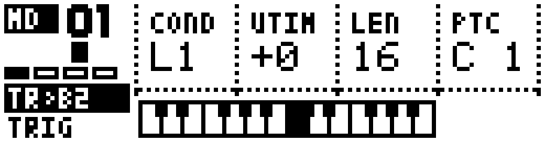

# Step Editor Page

The Step Editor (StepEdit) page is used to program MCL's internal sequencer for a selected MD track and is fully integrated with the MD's pattern editing user interface.

_Press **[Bank Group] + [Trig 5]** key to open the StepEdit page._

_Pressing the MD's **[Rec]** button will allow you to toggle in and out of the StepEdit page from anywhere within MCL._

| Control | Assignment |
| --- | --- |
| Encoder 1 | Trig Condition |
| Encoder 2 | Micro-Timing |
| Encoder 3 | Track Length |
| Encoder 4 | Note |
| Save / No | Toggles REC |
| Page | |
| Load / Yes | Rotate Sequencer Page | Apply All |
| Shift | Track Menu |

## GUI

- The StepEdit page leverages the MD's GUI for editing.
- Trig editing mode can be switched between Lock, Mute and Slide by pressing **[Function] + [Bank B/C/D]**respectively .
- On MCL the 16 steps of the current page for the current track are displayed on the bottom row.
- The **[Trig]** buttons on the MD correspond to the visible steps. Pressing a **[Trig]** will add the step. A press followed by quick release will remove the step.
- Trig Conditions and Micro-Timing settings are per step and are set by holding **[Trig]** and pressing the MD's **[Up/Down]** keys to change Trig Conditions and **[Left/Right]** for Micro-Timing.
- Parameter locks can be added to a step by selecting a **[Trig]** and then rotating the corresponding MD **[Encoder]**.
- When a parameter lock is set, the step LED will blink on the MD, and the MCL will display a filled rectangle above step trig on screen.
- Trigless locks are possible by pressing a **[Trig]** with parameter lock data, the step LED will become unlit and blink, signifying only lock data will be sent.
- Parameter locks can be removed individually by selecting a **[Trig]** and tapping the MD's matching **[Encoder]**.
- Hold the **[Trig]** and press **[Clear]** to clear a step.
- Parameter lock transmission can be disabled for any step by removing the lock step in LOCK editor mode.
- Trigs and parameter lock transmission can be temporarily disabled by adding a step in MUTE editor mode.
- A step can be muted/unmuted by holding down the matching **[Trig]** key and pressing **[Exit/No]**.
- A step can be previewed by holding down the matching **[Trig]** key and pressing **[Yes]**.
- The visible sequencer page can be toggled by pressing or the MD's **[Scale]** key.
- The steps of the sequence can be shifted left or right by holding the MD's **[Function]** key and pressing **[Left]** or **[Right]**
- The MD's **[Clear/Copy/Paste]** functions work across Track, Sequencer Page and Step.
- The Length and Speed of the track can be set via the MD's Scale menu by pressing **[Function]** followed by **[Scale]**.

## Trig Conditions

- L1,L2,L3,L4,L5,L6,L7,L8 (For Ln, step is only triggered after every n iterations of track)
- P10, P25, P50, P75, P90 (For Pxx, step has a xx percent chance of being triggered)
- 1S. (One Shot trig, step is only triggered once after load)
- Each trig condition above has a twin denoted by the \^ character e.g L1\^, L2\^, P1\^. When these condition modes are selected, parameter locks and slides must also obey the trig condition.

## Micro-Timing

When editing Micro-timing, the uTIMING window will be visible on both the MC and MD. The number of divisions between notes is dependent on the track's Speed setting.

_The MC's sequencer has a resolution of 1/192th per quarter notes_

## Track Speed & Length

All sequencer tracks can be played at an independent speed and length.

The chosen speed can be one of either: 1x, 2x, 3/2x, 3/4x, 1/2x, 1/4x, 1/8x.
Triplets can be achieved using either 3/2x, 3/4x.

- The MD's "Scale Setup" Menu accessible via **[Func] + [Scale]** can be used to quickly change the track speed & length. If the "Scale Setup" menu is opened outside of Step Edit mode, the speed & length changes will apply to all 16 tracks.

## Change Edit Mode

By default, the Step Edit page opens in Trig Edit mode. It is possible to change this edit mode to program the track's sequencer data for either Trigs, Locks, Slides or Mutes.

- Edit mode can be toggled between Trig, Lock, Mute and Slide by pressing the MD's **[Func] + [Bank B/C/D]** keys.

## Clearing a Sequence

- Enter [**Func]** + **[Clear]** to clear the current track when [**Rec**] LED lit, or all tracks when [**Rec]** LED unlit. (repeat the input to UNDO)

## Rotate Track Page

Each track consists of 4 pages of 16 steps, for a total of 64 steps per track.

- The MD's **[Scale]** button can be used to rotate the visible track page.

## Chromatic Step Edit

The Step Edit allows you to adjust a step's pitch by setting a note value.

- Press and hold trigger button(s) on the MD. Adjusting **`Encoder 4 `** will allow you change the note value of the selected steps.
- An external MIDI keyboard connected on Port 2, can be used to select the note.
- A keyboard will be drawn on the display, showing the current note.

## Slides

Each parameter lock can be made to slide up or down to the nearest step containing a parameter lock of the same type.

To add slides to your sequence change the Edit Mode to "SLIDE" (see above).

## Mutes

Individual steps of your sequence can be muted, by placing a mute trig at the corresponding position. Mutes are reset on sequencer restart.

To add mutes to your sequence change the Edit Mode to "MUTE" (see above).

Alternatively, from Pattern Edit, a step can be muted/unmuted by holding down the matching **[Trig]** key and pressing **[Exit/No]**.

## Shift Sequence

The sequence of an individual track can be shifted left or right. Press **[Function]** + **[Left/Right]** on the MD.

You can also shift the entire pattern left or right from the SHIFT menu via [**Global**].

Similarly you can reverse a track's sequence by pressing [**Function**] + [**Up**]

## Live Record

Live Record mode can be activated using the MD's **[Rec]** + [**Play**] function. The [**Rec**] LED will then blink to signify live recording is active. Both trig and parameter locks can be recorded simultaneously.

To record from an external DrumPad or Keyboard:

- Ensure that the **Config-->MIDI-->CTRL PORT** is set to the MIDI port your external DrumPad/keyboard is connected.
- Set **Config-->MIDI-->MD MIDI-->TRIG CHAN** from INT (internal) to a desired MIDI channel or OMNI (all channels).

Press [**Rec**] to end live recording and return to step edit mode.
