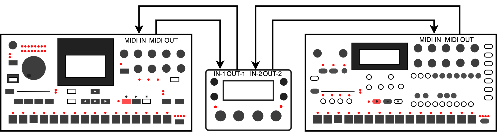
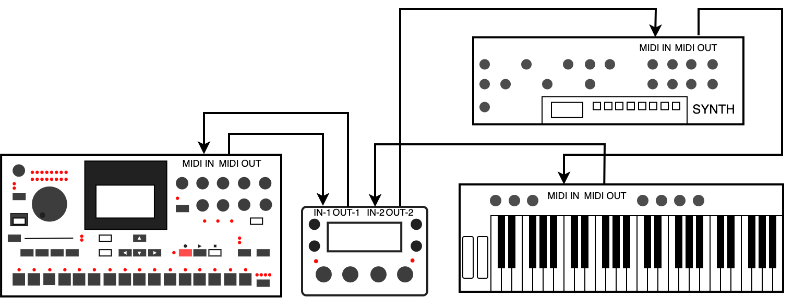

# MIDI Setup

## Setup Overview

MCL uses a Grid X / Grid Y device model. After connecting the devices, configure the active device layout from:

```text
CONFIG > MIDI > DEVICES
```

Then configure clock, routing, controller input and program-change behavior from the other MIDI configuration menus.

## Machinedrum

For the common Machinedrum setup:



| Connection | Cable |
| --- | --- |
| Machinedrum MIDI OUT -> MegaCommand MIDI IN 1 | Sends Machinedrum keys, transport, sysex and state changes to MCL. |
| MegaCommand MIDI OUT 1 -> Machinedrum MIDI IN | Sends sequencing, parameter, sysex and control data back to the Machinedrum. |

Recommended configuration:

| Setting | Value |
| --- | --- |
| `CONFIG > MIDI > DEVICES > GRID X > DEVICE` | `MD` |
| `CONFIG > MIDI > DEVICES > GRID X > PORT` | `MIDI 1`, meaning MegaCommand MIDI IN 1 / OUT 1 with standard 5-pin MIDI cables |

Upgrade the Machinedrum to OS X.13 before using MCL. For Machinedrum MK1 units, keep Turbo MIDI at `4x` or lower.

## Secondary Device

For a Monomachine or Analog Four as a secondary device:



| Connection | Cable |
| --- | --- |
| Device MIDI OUT -> MegaCommand MIDI IN 2 | Lets MCL receive sysex, transport or performance state where supported. |
| MegaCommand MIDI OUT 2 -> Device MIDI IN | Lets MCL sequence and control the device. |

Recommended configuration:

| Setting | Value |
| --- | --- |
| `CONFIG > MIDI > DEVICES > GRID Y > DEVICE` | `ELEKT` |
| `CONFIG > MIDI > DEVICES > GRID Y > PORT` | `MIDI 2` |

Upgrade the Monomachine to OS X.01 before using MCL.

## Generic MIDI Device

For a synth, sampler or drum module using generic MIDI:

| Connection | Cable |
| --- | --- |
| Controller or keyboard MIDI OUT -> MegaCommand MIDI IN 2 or USB | Optional live input for chromatic play, recording or controller forwarding. |
| MegaCommand MIDI OUT 2 or USB -> External device MIDI IN | Sends notes, automation and program changes from MCL. |

Recommended configuration:

| Setting | Value |
| --- | --- |
| `CONFIG > MIDI > DEVICES > GRID Y > DEVICE` | `GENER` |
| `CONFIG > MIDI > DEVICES > GRID Y > PORT` | `MIDI 2` or `USB` |

External MIDI tracks can be edited from the Piano Roll and can record or play notes and automation where supported by the selected device.

## TBD

When using TBD, the internal TBD device can be assigned directly from the device menu.

Typical options:

| Grid | Example use |
| --- | --- |
| Grid X = `TBD` / Port = `INT` | Use TBD as the primary internal device. |
| Grid X = `MD` / Port = `MIDI 1` | Use a connected Machinedrum as the primary device. |
| Grid Y = `TBD` / Port = `INT` | Use TBD as the secondary device. |

TBD can also use an internal clock source from the MIDI sync menu.

See [TBD](tbd.md) for TBD panel controls and sequencing behavior.

## Clock and Transport

Configure clock and transport from:

```text
CONFIG > MIDI > SYNC
```

MegaCommand and MegaCMD receive clock from Port 1, Port 2 or USB. TBD can additionally use the internal clock source.

## Analog Four Manual Settings

When using an Analog Four, configure these settings on the Analog Four itself:

| Analog Four setting | Value |
| --- | --- |
| MIDI output | MIDI |
| MIDI input | MIDI |
| Keyboard config | `EXT` |
| Receive notes | On |
| Receive CC/NRPN | On |
| Track MIDI channels | Tracks 1-6 mapped to channels 1-6 |
