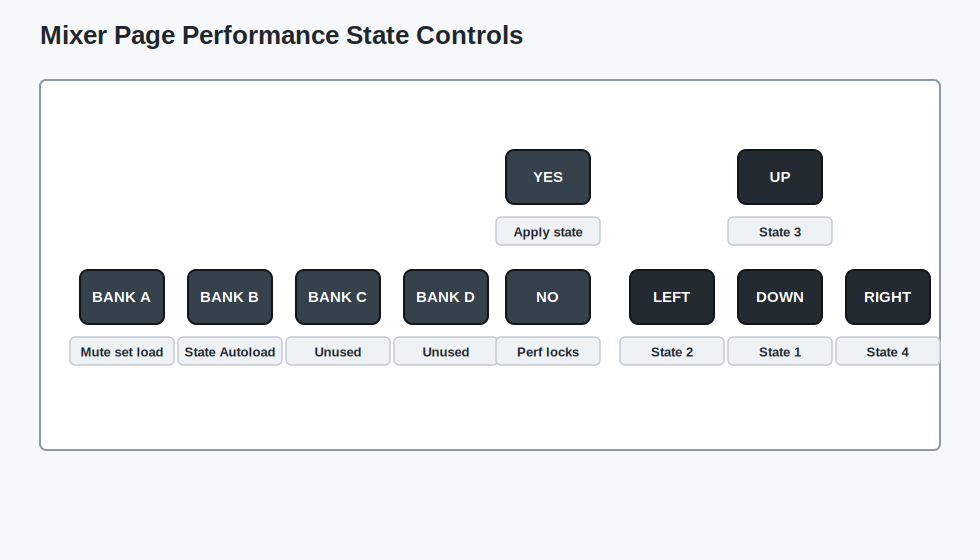

# Mixer Page

The Mixer Page is MCL's live performance hub. It shows track levels, mutes and fill state for the selected mixer target, and it gives quick access to performance controllers and four recallable performance states.

Open it with:

**[Bank Group] + [Trig 2]**

When the sequencer is running, **[Classic/Extended]** also opens and closes the Mixer Page.

## Mixer Target

The Mixer Page can control any connected device that exposes mixer tracks: Machinedrum, Monomachine, Analog Four, generic MIDI devices and TBD. Up to 16 tracks are shown at once.

Press **[Scale]** to switch the visible mixer target between the primary and secondary grid devices. If no mixer target has been selected yet, MCL chooses an available connected device and falls back to the Machinedrum when needed.

## Live Controls

| Control | Action |
| --- | --- |
| **[Trig]** | Select one or more visible tracks. |
| **[Trig]** + **[Yes]** | Toggle the selected track mutes. |
| **[Trig]** + **[No]** | Solo the selected tracks by muting the others. |
| **[Function]** + **[Yes]** | Flip the mute state of the visible tracks. |
| **[Classic/Extended]** + **[Trig]** | Fast mute toggle while the Mixer Page is latched open during playback. |
| Hold **[Trig]**, then press **[Classic/Extended]** | Restore selected track parameters to their last loaded values where supported. |
| **[No]** with no tracks held | Leave the Mixer Page, or jump to the current device mixer/FX page where available. |

## Mutes And Fill State

Mute mode is the default Mixer Page mode. Mutes silence the selected sequencer tracks and are stored with the track state.

Fill mode edits the separate per-track fill state used by the `FIL` and `!FL` trig conditions:

| Control | Action |
| --- | --- |
| **[Global]** + **[Scale]** | Toggle the Mixer Page between mute editing and fill editing. |
| **[Trig]** in fill mode | Toggle fill state for the selected track. |
| **[Trig]** + **[Yes]** in fill mode | Toggle fill state for the selected tracks. |
| **[Trig]** + **[No]** in fill mode | Solo fill state, enabling fill only for the selected tracks. |

Tracks with fill enabled are shown with the fill indicator. A step with the `FIL` condition plays only when fill is enabled for that track; a step with `!FL` plays only when fill is not enabled.

## Track Parameter Editing

Hold one or more track **[Trig]** keys and turn the encoders to edit supported mixer parameters across the held tracks. For Machinedrum tracks this works like a focused CTRL-ALL workflow for level and filter parameters. For other mixer targets, MCL uses the parameters exposed by the selected device.

Direct parameter changes received from the selected device are also mirrored to the other held tracks when the parameter is supported there.

## Sequencer Mute Recording

Sequencer mute recording writes mute activity into the active sequence.

| Control | Action |
| --- | --- |
| **[Trig]** + **[Global]** | Record sequencer mutes for the selected tracks. |
| **[Trig]** + **[Kit]** | Clear sequencer mute recording for the selected tracks. |
| **[Global]** + **[Kit]** | Clear sequencer mute recording for all mixer targets. |

## Performance Controllers

When the selected mixer target supports performance controllers, the four MCL encoders control Perf A through D. These controllers are configured on the Performance Page and are stored in the `PF` slot.

| Encoder | Assignment |
| --- | --- |
| `Encoder 1` | Perf A |
| `Encoder 2` | Perf B |
| `Encoder 3` | Perf C |
| `Encoder 4` | Perf D |

Hold **[Function]** while turning a performance encoder to hard-pan that controller to its minimum or maximum value.

## Performance States

The Mixer Page has four performance states mapped to **[Down]**, **[Left]**, **[Up]** and **[Right]**. A performance state is a live recall snapshot for the performance layer.

Each state stores:

- mute masks for the primary and secondary mixer targets
- fill masks for the primary and secondary mixer targets
- optional Perf A-D controller locks
- per-device load enable flags
- the optional autoload selection used when the `PF` slot is loaded

| Control | Action |
| --- | --- |
| Hold **[Down]**, **[Left]**, **[Up]** or **[Right]** | Preview that performance state. |
| While holding a state arrow, press **[Trig]** | Edit its stored mutes, or its stored fills when the Mixer Page is in fill mode. |
| While holding a state arrow, press **[Yes]** | Apply the state. |
| While holding a state arrow, press **[Bank A]** | Enable or disable mute set loading for the visible mixer target. |
| While holding a state arrow, press **[Bank B]** | Mark or unmark that state for `PF` slot autoload. |
| While holding a state arrow, hold **[No]** and turn a Perf encoder | Store a Perf A-D controller lock in that state. |
| While holding a state arrow, hold **[No]** and press a Perf encoder button | Add or clear the matching controller lock. |

Preview edits do not change the live mute or fill state until the performance state is applied.

## PF Slot Storage

Performance states are stored with the Performance Page data in the `PF` slot on Grid Y. Save the performance group or the `PF` slot after editing Mixer Page states, fill masks, performance locks or autoload settings.

Loading the `PF` slot recalls the Performance Page controllers and scenes. If a Mixer Page performance state is marked for autoload, that state can also be applied during the load.

## Scene Autofill Shortcuts

Scene Autofill creates kit morphs by storing changed kit parameters as scene locks for a performance controller.

| Control | Action |
| --- | --- |
| Hold a Perf encoder button + **[Global]** | Clear both scenes assigned to that controller. |
| Hold a Perf encoder button + **[Load/Yes]** | Autofill the controller's right scene from changed kit parameters. |

See [Performance Page](perf-page.md) for controller, scene and scene-lock editing.

## Machinedrum FX Shortcut

From the Mixer Page, press **[No]** with no tracks held to open the current device's mixer or FX page where available. On Machinedrum FX pages, hold **[No]** and press **[Left]** for Delay/Echo or **[Down]** for Reverb. Press the same direction again while still holding **[No]** to switch that FX page between its two parameter groups. Release **[No]** to return to the Mixer Page.
