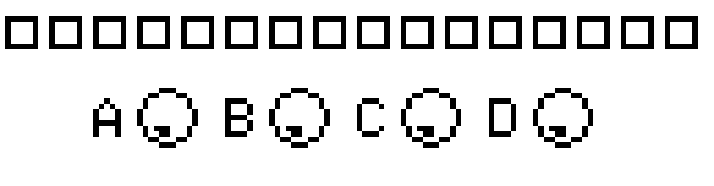
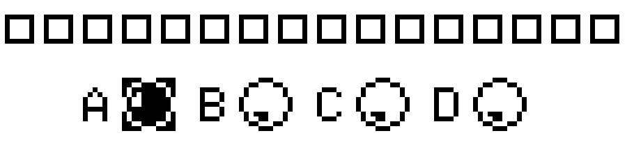

# Mixer Page

The Mixer Page serves as the core performance hub for MCL. Initially, it displays the volume levels and mute states for the Machinedrum. Moreover, it can be configured to control and display the mute state of External MIDI tracks. When playing, the level meters fluctuate to indicate the tracks have been triggered by the sequencer.

The Mixer Page is accessible by pressing **[Bank Group] + [Trig 2]**.
Or pressing **[Classic/Extended]** when the sequencer is running.

| Control | Assignment |
| --- | --- |
| Save / No | -- |
| Page | PageSelect |
| Load / Yes | -- |
| Shift | -- |

## Device Selection

Press the **[Scale]** key to alternate the Mixer Page's view between the MD or External MIDI tracks.

## Track Mute Toggle

Holding down one or more the MD's **[Trig]** keys and then pressing **[Enter/Yes]** will toggle the selected track's mute state.

With the **[Classic/Extended]** button held down, pressing one or more of the MD's **[Trig]** keys will also toggle the selected track's mute state.

## Track Solo

Holding down one or more the MD's **[Trig]** keys and then pressing **[Exit/No]** will solo the selected tracks.

## Mute Flip

Holding **[Function]** and then pressing **[Enter/Yes]** will flip the mutes for the visible tracks.

## MDFX

For quick access to FX Delay and FX Reverb pages:

- hold **[Exit/No]** + toggle **[Left]** for DELAY.
- hold **[Exit/No]** + toggle **[Down]** for REVERB.

## CTRL-Track

The Mixer Page allows you to modify multiple machine parameters across different tracks simultaneously,
The Machinedrum **[Encoders]** can be used to manipulate any specific parameter across selected tracks, similar to the MD's built in CTRL-ALL functionality.

Select one or more MD tracks by holding down the corresponding **[Trig]** keys, modifying a MD parameter will cause the same parameter to be updated on all of the selected tracks.

## Track Parameter Recall

Holding MD **[Trigs]** and pressing **[Classic/Extended]** will reset the parameters of each selected track to the value set last load.

## Sequencer Mute Record

Mutes can be recorded into the sequencer in realtime by selecting a track via the MD **[Trig]** and pressing **[Global]**.

Sequencer mutes can be cleared for a specific track by holding **[Trig]** and pressing **[Kit]**.

Sequencer mutes can be cleared for all tracks by holding **[Global]** and pressing **[Kit]**.

## Performance States

There are four Performance states, each is mapped to one of the MD's **[Up/Down/Left/Right]** keys.
A Performance State stores predefined Mute settings for each of the MD and External MIDI tracks. A Performance State may also include four Performance Controller Locks.

### Performance State Preview

Performance States can be visually previewed from the Mixer Page by holding one of the MD's **[Up/Down/Left/Right]** keys.

### Performance State Apply

To apply mute and performance lock settings in a Performance State, hold down one of **[Up/Down/Left/Right]** and press **[YES]**.

### Performance State Mute Edit

When a Performance State is previewed, the mutes can be edited by toggling the **[ Trig ]**.

_No changes to the current mute state will occur until applying a Performance State._

### Performance State Mute Disable

When a Performance State is previewed, the mutes for the visible tracks can disabled by pressing **[Mute/BankA]**.

### Performance State Grid Storage

All four Performance States are stored and loaded from the **PF** slot in track 12, Grid Y. (See section: Performance Page.)

### Performance State Grid Autoload

A chosen Performance State can now be made to auto-load when the Perf Slot in Grid Y is loaded:

- From the Mixer Page, Hold an **[Up/Down/Left/Right]** key to preview the Performance State and then press **[Accent/BANKB]** to enable auto **"LOAD"**.
- Then save the Perf Slot, in Grid Y.

## Performance Controllers

When accessing the Mixer Page, the four MegaCommand encoders are the Performance Controller's (A,B,C,D) as configured from the Performance Page or loaded from the PF Track stored in Grid Y, column 12.

| Control | Assignment |
| --- | --- |
| Encoder 1 | Perf Controller A |
| Encoder 2 | Perf Controller B |
| Encoder 3 | Perf Controller C |
| Encoder 4 | Perf Controller D |

### Performance Controller Locks

When a Performance State is previewed, holding **[Exit/No]** whilst rotating one of the MC **`Encoders`** will add a Performance Controller Lock for the corresponding Performance Controller.

The Performance Controller Locks will be recalled upon loading a chosen Performance State.

Controller locks visually invert when locked and can be cleared by pressing the `Encoder` button.

### Performance Controller Scene Autofill

Scene Autofill can achieve Kit parameter Morphing, by automatically storing modified kit parameters as Scene Locks.

- A Perf Controller's assigned left and right scenes can be auto-cleared with by holding down the MC's **`Encoder Button`** and pressing the MC's **< Shift >** button.
- A Perf Controller's assigned right scenes can be auto-filled with any altered Kit parameters by holding down the MCL **< Encoder Button >** and pressing the MC's **< Yes / Load >** button.

_See the Performance Page section of this Manual to learn more about Scenes and Scene Locks._
