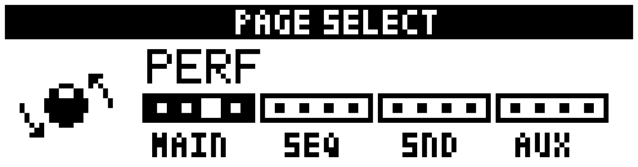
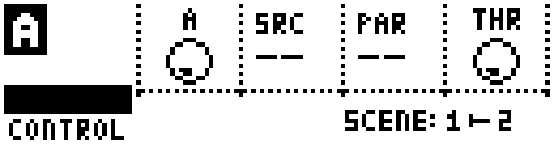
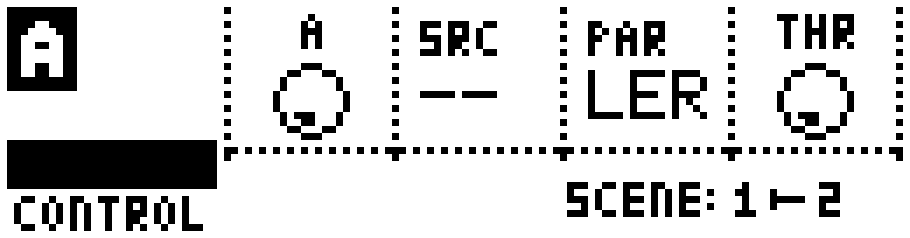
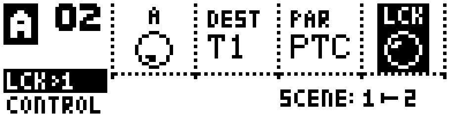

# Performance Page

The Performance (Perf) Page features four user programmable Performance Controllers (A,B,C,D) sharing a common pool of eight scenes. Each controller can be assigned two scenes from the shared pool, with each scene comprised of 16 parameter locks. When rotated, a performance controller will morph between the parameter locks of its two assigned scenes.

_Perf controller data, scenes and performance locks can be either stored or recalled by saving or loading to the PF track slot._

_To enter the Perf Page: press and hold **[Bank Group]**, then press **[Trig 3]**._

| Control | Assignment |
| --- | --- |
| Save / No | |
| Page | PageSelect |
| Load / Yes | Toggle SubPage |
| Shift | Controller Menu |

To indicate the **active controller**, a character A,B,C or D is positioned in the top left of the screen.

The **active controller** can be chosen from the controller menu accessible by holding **[Global]** and selecting **[Trig]** keys 1->4.

The controller name is shown at the bottom left of the screen, and defaults to "CONTROL". Each controller can be **renamed** from the controller menu.

## Control

**`Encoder 1`** controls the value of the active Performance Controller, rotating it will morph between the assigned scenes. Holding **[Function]** whilst rotating encoder 1 will hard pan the controller left or right.

| Control | Assignment |
| --- | --- |
| Encoder 1 | Controller |
| Encoder 2 | Source |
| Encoder 3 | Parameter |
| Encoder 4 | Threshold |

Performance Controllers A,B,C,D can be controlled externally by mapping them to any MD parameter, or any MIDI Channel + CC on port 2.

**`Encoders 2 and 3`** assign the **Source** track/channel and **Parameter** values for which the controller will respond to External Control.

A parameter "LEARN" feature can be used to automate mapping by setting Source to "--" and Para to "LER".

The **`Encoder 4`** is the **Threshold** encoder and can be used to restrict the operating range of the external control to above a specified value.

## Scenes

### Overview

The Performance Page features a shared pool of 8 Scenes. Each scene can store 16 parameter locks. A parameter lock can be any MD track parameter and Master FX parameter, or any external MIDI CC. Each scene is mapped to the MD's **[Trig]** keys 1 through 8.

### Assigning Scenes

Each performance Controller can be assigned two scenes from the pool, one LEFT and one RIGHT. The scenes assignment is shown at the bottom right of the screen.

To assign the left most scene, hold **[Left]** and select a scene from the MD **[Trig]** keys.

To assign the right most scene, hold **[Right]** and select a scene from the MD **[Trig]** keys.

### Scene Locks

| Control | Assignment |
| --- | --- |
| Encoder 1 | Controller |
| Encoder 2 | Lock Destination |
| Encoder 3 | Lock Parameter |
| Encoder 4 | Value |

To assign a lock to a scene, hold the corresponding Scene **Trig** and rotate the desired parameter on the MD or external MIDI.

With the scene **Trig** held down, it is possible to view and edit the active locks by pressing the **[Up]** and **[Down]** arrows.

### Scene Clear/Copy/Paste

Each scene can be cleared, copied or pasted to another scene by holding the corresponding **[Trig]**, and pressing the respective key **[Clear]**, **[Copy]**, **[Paste]**.

### Scene Preview

To preview a scene, hold the corresponding **[Trig]** and then press **[Enter/YES]**.

## Grid Saving or Loading

All four Performance Controllers and the shared pool of eight Scenes can be stored or recalled from the **PF** slot in column 12 in Grid Y.

Additionally, the **PF** slot also stores the MixerPage's four Performance States including track Mute settings and Performance Controller locks.
