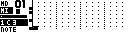
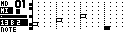
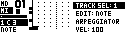
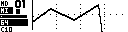

# PianoRoll Editor Page

The PianoRoll Editor edits the secondary/external-style sequencer tracks. These are the Grid Y MIDI-style tracks used for generic MIDI, A4/MNM-style targets and TBD MIDI tracks.

Open it with:

**[Bank Group] + [Trig 7]**

The page has two edit views:

| View | Use |
| --- | --- |
| `NOTE` | Edit notes, pitch, velocity, condition and note length. |
| Automation / lock lane | Edit one parameter-lock lane such as CC, NRPN, RPN, pitch bend, pressure, program change or a device parameter where supported. |

## Display Model

PianoRoll time is continuous inside each sequencer step. Notes and locks can be placed between grid steps with the track's internal timing resolution. The display shows a 16-step page at a time, with a small overview strip showing the visible area and playback position.

The vertical keyboard on the left shows the note range currently in view. In automation view, the vertical axis becomes the lock value.

## Main Controls

| Control | Note view | Automation view |
| --- | --- | --- |
| `Encoder 1` | Move the time cursor. | Move the time cursor. |
| `Encoder 2` | Move the note cursor. | Move the lock value cursor. |
| `Encoder 3` | Change note width. | Change edit width. |
| `Encoder 4` | Change zoom. | Change zoom. |
| **[Yes]** / **[Load/Yes]** | Add or remove the note at the cursor. | Add or remove a lock at the cursor. |
| **[Scale]** | Move to the next 16-step page. | Move to the next 16-step page. |
| Hold **[Global]** | Open the Track Menu. | Open the Track Menu. |

The MD trig keys jump the time cursor to step positions on the current 16-step page. If external notes are held, pressing **[Yes]** or a trig key writes the held note or chord at the cursor.

## Cursor Movement

| Control | Action |
| --- | --- |
| **[Left]** / **[Right]** | Move the cursor in time. |
| **[Up]** / **[Down]** | Move pitch in note view, or lock value in automation view. |
| **[Function]** + arrows | In note view, move faster. In automation view, move in finer time/value increments. |
| **[Yes]** + **[Left]** / **[Right]** | Fine time movement. |
| **[No]** + **[Left]** / **[Right]** | Change note width when no selection rectangle is active. |
| **[Yes]** + **[No]** + **[Up]** / **[Down]** | Change zoom. |
| Hold **[No]** or a trig, then press **[Clear]** | Delete notes under the current cursor width in note view. |

## Note Selection Rectangle

Use the note selection rectangle for focused note edits.

| Control | Action |
| --- | --- |
| **[No]** + **[Down]** | Start a selection rectangle from the current cursor. |
| Keep holding **[No]**, then press arrows | Resize the selection in time or pitch. |
| Selection active + **[Copy]** | Copy the selected notes. |
| Selection active + **[Clear]** | Clear the selected notes. |
| Rectangle copied + **[Paste]** | Paste the copied notes at the cursor pitch/time. |

Rectangle copy preserves the selected shape. When pasted, the copied notes are transposed relative to the cursor pitch.

## Page Copy, Clear And Paste

Hold **[Scale]** with copy, clear or paste to work on the visible 16-step page.

| View | Control | Action |
| --- | --- | --- |
| Note | **[Scale]** + **[Copy]** | Copy all notes on the current page. |
| Note | **[Scale]** + **[Clear]** | Clear all notes on the current page. Repeat the clear/paste operation to undo where shown. |
| Note | **[Scale]** + **[Paste]** | Paste a copied note page at the current page. |
| Automation | **[Scale]** + **[Copy]** | Copy the current lock lane page. |
| Automation | **[Scale]** + **[Clear]** | Clear the current lock lane page. Repeat the clear/paste operation to undo where shown. |
| Automation | **[Scale]** + **[Paste]** | Paste a copied lock page into the current lock lane. |

When pasting between tracks with different timing, page clips are scaled to the destination track timing.

## Track Menu

Hold **[Global]** to open the Track Menu. The visible entries depend on whether `NOTE` view or an automation lane is selected.

Common entries:

| Entry | Function |
| --- | --- |
| `TRACK SEL` | Select the active external-style track. |
| `EDIT` | Select `NOTE` view or an automation lock lane. |
| `SPEED` | Set track playback speed. |
| `LENGTH` | Set track length up to 128 steps. |
| `CHANNEL` | Set the MIDI channel for the track, or an MD route target when available. |
| `COPY`, `PASTE`, `SHIFT`, `REVERSE`, `TRAN` | Track-level edit operations. |
| `QUANT` | Toggle quantized live recording. |
| `CC REC` | Enable or disable live automation recording. |

Note view adds:

| Entry | Function |
| --- | --- |
| `VEL` | Default velocity for newly entered notes. |
| `COND` | Default note/trig condition. |
| `ARPEGGIATOR` | Open the per-track Arpeggiator Page. |
| `CLEAR` | Clear the track or selected scope. |

Automation view adds:

| Entry | Function |
| --- | --- |
| `CC` / parameter select | Choose the parameter controlled by the current lock lane. |
| `SLIDE` | Glide/interpolate lock values between steps where supported. |
| `CLEAR LOCKS` | Clear lock data for the current lane or wider scope. |

## Track Selection And Mutes

While the Track Menu is open, the trig keys select or mute secondary/external tracks:

| Trig keys | Action |
| --- | --- |
| **[Trig 1-6]** | Select external-style tracks 1-6, limited by the connected device's available track count. |
| **[Trig 9-14]** | Toggle mutes for external-style tracks 1-6. |

Muting an external/MIDI-style track sends note-offs so currently held notes are silenced.

## External MIDI Track Routing

External MIDI tracks normally send notes and automation to the configured secondary MIDI device on channels `1..16`. When Machinedrum is the primary grid device, the `CHANNEL` setting can also route the track into Machinedrum polyphonic voice groups.

To route an external track to the Machinedrum:

1. Open the PianoRoll Track Menu.
2. Select `CHANNEL`.
3. Scroll past MIDI channel `16`.
4. Choose `MD1` through `MD16`.

`MD1` through `MD16` refer to Machinedrum primary tracks, not external MIDI channels. Notes on the external track are sent through the Polyphony Page voice allocator for the selected Machinedrum track or voice group. If the selected track belongs to a poly group, MCL chooses an available voice from that group. If it does not belong to a group, the route addresses that track directly where the machine supports pitched playback.

In route mode, automation and parameter locks can target Machinedrum track parameters. CC numbers `16..39` correspond to the 24 Machinedrum track parameters for the routed target, and the automation lane menu shows the matching parameter labels where MCL can resolve them from the current kit.

## MIDI Input And Live Recording

Configure controller input from:

`CONFIG > MIDI > CONTROLLER > INPUT`

Incoming notes on the track's MIDI channel can move the note cursor, enter notes and record live notes. Incoming control data can also be recorded into automation locks when `CC REC` is enabled.

Start live recording with:

**[Rec] + [Play]**

Recording follows the track MIDI channel. Notes, note-offs, CC, pitch bend, channel pressure and poly pressure are routed to the matching track where supported by the connected device.

## Automation Lock Lanes

Each automation view edits one lock lane. Legacy external tracks provide the familiar MIDI automation lanes; current MIDI/TBD paths can expose more detailed targets.

Supported lock targets include:

- MIDI CC
- NRPN and RPN on supported targets
- pitch bend (`PB`)
- channel pressure (`CHP`)
- poly pressure
- program change (`PRG`)
- device parameters exposed by TBD or configured MIDI targets
- `LEARN`, which assigns the lane from the next matching incoming control

When the track `CHANNEL` is set to an `MD1`-`MD16` route target, the lock lane uses Machinedrum track parameters for that route target. This lets a PianoRoll track play a Machinedrum polyphonic voice group and automate the same destination's sound parameters.

Hold a step trig and move an external control to write a lock at that step. In automation view, pressing **[Yes]** toggles a lock at the cursor using the current lock value.

Program change automation is one-shot style. Slide applies to continuous lock values where the target supports interpolation.
