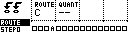
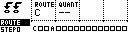

# Route Page

The Route Page is used to direct the audio of a specific MD track to a selected output.

_Routing configuration can be either stored or recalled by saving or loading to the corresponding Auxiliary track Route slot._

_The Route page can be accessed by pressing **[Bank Group]** and **[Trig 4]**._

| Control | Assignment |
| --- | --- |
| Encoder 1 | Output Selection |
| Encoder 2 | Quantization |
| Encoder 3 | -- |
| Encoder 4 | -- |
| Save / No | -- |
| Page | PageSelect |
| Load / Yes | -- |
| Shift | -- |

**`Encoder 1`** can be used to select the audio output destination. The destination can be one of MD's external outputs C, D, E, F.

The MD's **[Trig]** keys are used to toggle the output of selected tracks, between Main Outputs and the chosen external output.

## Quantization Rules

The quantization rules specify the timing of the routing changes so that they are in sync with the sequencers.

The minimum quantization value is 2 steps. Quantization values can be changed by adjusting
the ”Q:” parameter, and increase in powers of 2. Holding down the encoder button will step
increment the quantization value.

- --: No quantization.
- 02: Apply route toggles on the next 2-step boundary.
- 04: Apply route toggles on the next 4-step boundary.
- 08: Apply route toggles on the next 8-step boundary.
- 16: Apply route toggles on the next 16-step boundary.
- 32: Apply route toggles on the next 32-step boundary.
- 64: Apply route toggles on the next 64-step boundary.

## Grid Saving or Loading

The routing configuration can be saved and loaded from Grid Y's **`RT`** route slot, along with per-track PTC group assignments. Save the **`RT`** slot, or use the route group on the Save and Load pages, when route edits should be recalled later.

_For more information on slot positions and their corresponding tracks see "Sequencer: Saving and Loading"._
