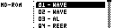

# Sample Manager Page

The Sample Manager transfers samples between the Machinedrum UW sample memory and the MCL SD card.

Open it with:

**[Bank Group] + [Trig 9]**

Supported file types:

| Type | Use |
| --- | --- |
| `.wav` | PCM WAV samples. |
| `.syx` | MIDI SDS sample dumps, including official Machinedrum sample-pack files. |

Sample transfer requires a Machinedrum UW model for sample playback/storage.

## File Locations

MCL uses these logical SD-card folders:

| Folder | Contents |
| --- | --- |
| `/Samples/WAV` | WAV files and received samples. |
| `/Samples/SYX` | SDS/SysEx sample files. |

On non-AVR builds with an initialized `/MCL` root folder, these folders live under `/MCL`, for example `/MCL/Samples/WAV`.

The browser filters the file list to `.wav` and `.syx` files. Folders are shown so sample sets can be organized.

## Browser Controls

| Control | Action |
| --- | --- |
| **[Up]** / **[Down]** | Move through entries. |
| **[Yes]** / **[Load/Yes]** | Enter a folder, start receive from `[RECV]`, or send the selected file. |
| **[No]** | Cancel, leave a picker, or move back depending on the current browser state. |
| Hold **[Global]** | Open the file menu. |

The file menu can create folders, rename files, clone or duplicate regular sample entries, delete files, and run bulk sample send/receive when the `[RECV]` action row is selected.

## Receiving One Sample

1. Select `[RECV]`.
2. Choose a Machinedrum sample slot from the slot list.
3. Enter or confirm the filename.
4. MCL receives the SDS dump, converts it to WAV, and saves it in the current folder.

The slot list shows ROM slots first. RAM slots are shown as `R1` through `R4` where the connected UW model reports them.

## Sending One Sample

Select a `.wav` or `.syx` file and press **[Yes]**. MCL opens the Machinedrum slot picker, asks for overwrite confirmation, and sends the file to the chosen slot.

For WAV files whose names start with two digits, a single-file send strips the leading two digits from the sample name sent to the Machinedrum. This keeps numbered bulk-transfer filenames readable on the MD.

## Bulk Receive And Send

Bulk actions are available from the file menu while the `[RECV]` row is highlighted.

| Action | Result |
| --- | --- |
| `RECV ALL` | Receives occupied Machinedrum sample slots into the current folder. |
| `SEND ALL` | Sends numbered WAV files from the current folder back to their matching slots. |

Bulk receive prefixes filenames with a two-digit slot number, such as `01KICK.wav`. Bulk send uses that prefix to choose the destination slot. Files without a two-digit prefix are skipped by bulk send.

## Transfer Notes

Sample transfers use the configured Machinedrum MIDI port. If external MIDI clock is present, MCL temporarily protects the transfer path where required by the platform.

Press the Machinedrum **[No]** key repeatedly to cancel a transfer.

Loop points from received looped SDS samples are stored in the saved WAV file. MCL's WAV reader also handles common non-standard WAV chunk layouts.

## WAV File Guidelines

- Use mono WAV files for Machinedrum UW playback.
- Sample rates from 4 kHz to 48 kHz are accepted; 44.1 kHz and 22.05 kHz are typical choices.
- Common bit depths are accepted and converted for the Machinedrum's sample format.
- Keep filenames short enough for the SD browser and the Machinedrum sample-name display.
