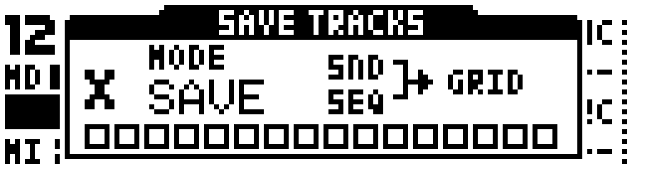

# Save Page

The Save Page is used to save track data to specific slots in the current row of the active Grid.

Available save modes:

- SAVE: Save the MCL's sequencer data and associated device's sound data.

_The Save Page is accessible from the GridPage by pressing the MD's **[Function] + [Enter/Yes]** keys._

| Control | Assignment |
| --- | --- |
| Encoder 1 | Mode |
| Encoder 2 | -- |
| Encoder 3 | -- |
| Encoder 4 | -- |
| Save / No | Cancel Save |
| Page | Toggle Grid |
| Load / Yes | -- |
| Shift | Group Select |

## Saving Individual Tracks

The Save Page utilises the MD's **[Trig]** keys to specify which tracks are to be stored. Pressing and releasing multiple **[Trig]** keys will save the corresponding sequencer tracks to the matching slots in the current row of the visible Grid.

## Grid Toggle

The **[Scale]** button can be used to toggle between Grid X, the 16 MD tracks, or Grid Y, the EXT (1-6) and AUX (12-16) tracks, over the MDs **[Trig]** keys.

## Simultaneous Save from Grid X and Grid Y

It is possible to simultaneously save a collection of tracks from both Grids X and Y.

- First select the tracks from Grid X pressing and holding the corresponding **[Trig]** keys.
- Tap **[Scale]** to switch grids
- Release the **[Trig]** selection
- Select the EXT tracks pressing and holding the corresponding **[Trig]** keys.
- Finally release the second grid **[Trig]** selection to confirm the action.

## Save Track Groups

When in the Save or Load Page, holding the MD's **[Enter/Yes]** key opens the Group Select menu, allowing you to load or save all tracks corresponding to a group. An entire row (pattern) including tracks across both Grids X + Y can be loaded or saved this way.

There are five groups:

- MACHINEDRUM _(Grid X tracks 1-16) + MDFX (**FX** = Grid Y track 13)_
- EXT MIDI DEVICE (A4/MNM/Generic MIDI) _(Grid Y tracks 1-6)_
- PERF _(**PF** = Grid Y track 12) + LFOTrack (**LF**= Grid Y track 15) )_
- RouteTrack _(**RT** = Grid Y track 14)_
- TEMPO _(**TP** = Grid Y track 16)_

From the Group Select Menu each group can be enabled/disabled using the MD's **[Trig]** keys 1-5.

Releasing **[Enter/Yes]** will save tracks corresponding to the active groups.
