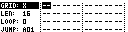
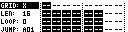

# Slot Menu

The Slot Menu edits one slot or a rectangular range of slots from the Grid Page. It is the fastest way to adjust length, loop, jump and sequence-only load behavior without entering the full Save or Load page.

Open it by holding **[No/Exit]** on the Grid Page.

## Range Selection

When the Slot Menu is open, the selected area starts at the current cursor position.

| Control | Action |
| --- | --- |
| Encoder 3 | Adjust selection width. |
| Encoder 4 | Adjust selection height. |
| **[Left]** / **[Right]** | Adjust selection width. |
| **[Up]** / **[Down]** | Adjust selection height. |
| **[Function]** + arrow | Adjust faster where supported. |

On TBD, arrows navigate Slot Menu entries first; hold the normal function modifier to adjust selection geometry.

## Menu Entries

| Entry | Values | Function |
| --- | --- | --- |
| `GRID` | `X`, `Y` | Switch the active grid. |
| `LEN` | 1-64 or 1-128 depending on track type | Override or edit slot/track length. |
| `LOOP` | 0-63 | Number of repeats before following the slot's jump row in Auto mode. |
| `JUMP` | `A01`-`H16` | Row to load after the loop count is reached. |
| `SOUND` | `OFF`, `ON` | Choose whether loading this slot also loads sound/device state. |
| `CLEAR` | `--`, `YES` | Clear the selected slot range. |
| `COPY` | `--`, `YES` | Copy the selected slot range. |
| `PASTE` | `--`, `YES` | Paste copied slot data at the selected position. |
| `RENAME` | Action | Rename the current row. |

`SOUND` is new in MCL 5.00. Set it to `OFF` to load sequence data without replacing the destination sound.

## Applying Changes

Slot Menu changes are applied when the menu closes.

| Action | Result |
| --- | --- |
| Release **[No/Exit]** | Apply changed slot settings. |
| Press **[Yes/Enter]** while the menu is open | Load the selected slot range. |
| Press copy/clear/paste commands | Apply the corresponding slot edit immediately. |
| Use `RENAME` | Open row-name entry for the current row. |

## Editing A Range

Length, loop, jump and sound-load changes apply across selected columns on the current row. Multi-row ranges are used for load, copy, clear and paste.

When changing length or loop across multiple slots in the current row, MCL tries to preserve musical duration where possible. For example, changing loops for a selected group can scale compatible slots instead of blindly applying a value that would make shorter tracks end too early.

## Copy, Paste And Undo

Copy and paste work on the selected rectangle. Clearing a range stores undo information for the same start position, so a mistaken clear can be restored from the Slot Menu workflow.

## Loading From The Slot Menu

Press **[Yes/Enter]** while the Slot Menu is open to load the selected range.

If the selection spans more than one row, MCL temporarily uses Queue mode so each selected row can be loaded in sequence.

Use the **[Bank A]**, **[Bank B]** and **[Bank C]** shortcuts while the Slot Menu is open to switch the active load mode:

| Key | Load mode |
| --- | --- |
| **[Bank A]** | Manual |
| **[Bank B]** | Auto |
| **[Bank C]** | Queue |
