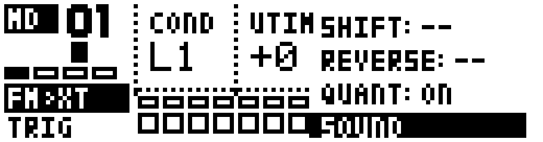
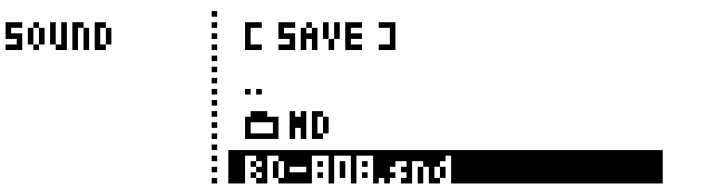

# Sound Manager Page

Machinedrum Sound presets can be stored via the Sound Manager page. A sound preset includes a track's machine assignment, and it's associated parameters. It can consist of machine settings from a single track, or two tracks linked by a TrigGroup.

Sound Presets are stored on the MegaCommand's SD Card as a $.snd$ file type.

_The Sound Manager is accessible from the Sequencer menu, accessible by holding **[Global]** and selecting "Sound" from the Step Edit page._

## Navigating the Sound Manager Page

- Use the **[Up]** and **[Down]** arrow keys to scroll through.
- Press **[Enter/Yes]** to enter a directory, or load a sound to the current track.
- Press **[Exit/No]** to exit/cancel.
- Press and hold **[Global]** to create a new folder, delete or rename a sound.

Note that the Sound Manager will filter the directory content for file $.snd$ file types.

## Saving Sound Presets

To save a **SOUND**:

- Select the desired track on the MD.
- Select [SAVE]
- From within the MD, two tracks can be linked by configuring the TrigGroup settings on one, to trigger the other. When two tracks are linked, both the source and destination track machine settings will be stored together to form a single sound.

## Loading Sound Presets

To load a Sound Preset, select the sound file the from the file browser panel and press **[Enter/Yes]**. The sound will be transferred to the active track of the Machinedrum. If a sound consists of two tracks (linked by TrigGroup), the adjacent track will also be loaded with the sound preset data.

## Delete or Rename Sounds:

- From within the Sound Browser, press and hold **[Global]** to access the file options menu.
- From the file options menu, you may delete or rename sound files or create new directories.
- Use the encoder to make your selection, release **[Global]** to activate your choice.
