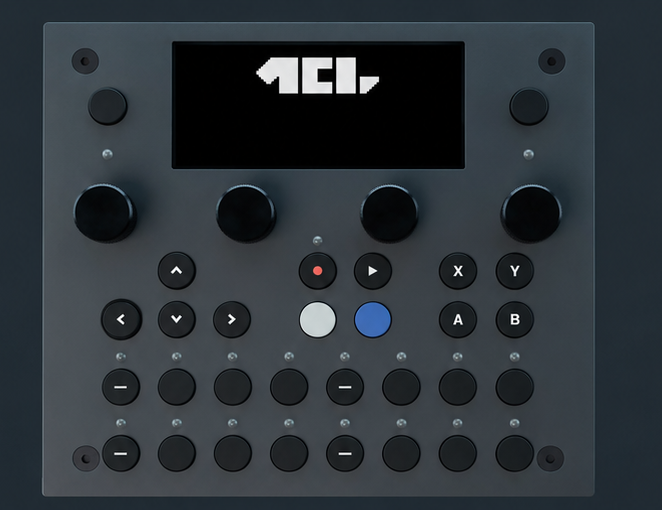

# TBD-16 Hardware Platform

The [TBD-16](https://dadamachines.com/products/tbd-16/) is a hardware platform that can run MCL. It supports all of MCL's external MIDI devices, such as the Machinedrum, but also has an `INT` mode for controlling the internal TBD sound engine.

Select `TBD` with the `INT` port when you want the internal sound engine to be sequenced, saved, loaded, mixed and parameter-locked from the normal grid and editor pages.

## Device Setup

Open the device menu from:

```text
CONFIG > MIDI > DEVICES
```

On TBD-16, MCL adds the `TBD` device and the `INT` port to the normal grid setup:

| Setting | Use |
| --- | --- |
| `Grid X = TBD`, port `INT` | Use the internal TBD sound engine as the primary step-sequenced device. |
| `Grid Y = TBD`, port `INT` | Use the internal TBD sound engine as the secondary MIDI-style device. |
| `Grid X = MD`, port `MIDI 1` | Use a connected Machinedrum as the primary device. |
| `Grid Y = GENER` or `ELEKT` | Use generic MIDI, Monomachine or Analog Four style secondary tracks. |

The selected grid device determines the track types that are created in new projects and the editor pages used for those tracks.

## Grid Tracks

`Grid X = TBD` gives you 16 internal TBD step tracks in slots 1-16. These use the Step Editor, Mixer, Chromatic Page, Arpeggiator Page and LFO Page.

`Grid Y = TBD` gives you six TBD tracks for PianoRoll sequencing and automation.

Internal TBD grid slots can store:

| Data | Meaning |
| --- | --- |
| Sequence data | Trigs, notes, lengths, loop settings, mutes, conditions and timing. |
| Sound state | The current TBD sound metadata and parameter values for the track. |
| Mixer state | Visible mixer parameters exposed by the current TBD sound. |
| Parameter locks | Step locks for visible TBD audio and mixer parameters, plus note locks for sounds that use per-step pitch. |

## Device UI, Presets And Parameter Strip

The TBD UI is split into matching Device 1 and Device 2 views. The top-left button opens the UI for controlling Device 1; the top-right button opens the UI for controlling Device 2. Each view can show parameter pages, the preset browser, or the bottom four-encoder strip.

The four encoders edit the visible parameters for the active track. In the full-screen view, arrow keys move between parameter pages and the preset browser.

The preset browser uses Encoder 1 for the machine/preset group and Encoder 2 for the preset. Press Encoder 2 to load the selected preset. `NO TRACK` means the selected sequencer track has no TBD sound; `NO PRESETS` means no preset list is available.

## Panel Controls



TBD-16 panel input is mapped into MCL's page and device model.

| Control | Action |
| --- | --- |
| Top-left button | Open Page Select from normal pages. When the device UI is active or collapsed, short-tap to enter the focused primary device UI. In menus and browsers, use it as back/up. |
| Hold top-left while the device UI is active | Leave the device UI and open Page Select. |
| Top-left + top-right | Open the System menu. |
| Top-right button | Open or control the secondary device UI when a secondary UI device is configured. In local menus it acts as the confirm/enter key. |
| Encoder 1 tap | Open or close the Grid bank popup. |
| Arrow keys | Navigate pages, menus, steps and selected values. |
| Transport keys | Act as Record, Play and Stop. In copy mode they act as Copy, Clear and Paste. |
| Trig pads | Select rows, trigger tracks, edit steps, play notes or select TBD UI tracks depending on the active page. |
| B button | Acts as Scale/page toggle on Grid, Mixer, Save/Load selection views and sequencer pages; otherwise it acts as the legacy menu modifier. |
| Y button | Opens legacy MCL page menus on Grid, Mixer, Save/Load selection views and sequencer pages; otherwise it acts as Function. |

If an expanded device UI is active, TBD device controls get first chance to handle the buttons. If the device UI is collapsed, the active MCL page handles the same buttons.

## Grid Page Differences

On TBD-16, Save and Load keep the Grid Page visible instead of opening separate full-screen pages.

| Action | Result |
| --- | --- |
| Open Save | Select the current Grid Page slots and save them without leaving the grid. |
| Open Load | Select the current Grid Page slots and load them without leaving the grid. |
| Slot Menu arrows | Move through Slot Menu entries first. Use the normal modifier behavior when adjusting selection geometry. |
| Bank popup | Use the bank popup to jump to rows and keep row-bank feedback visible while selecting. |

The visible grid still follows the same row, slot, bank, chain and queue concepts described in the Grid sections.

## Clock And Tempo

TBD-16 can use the internal clock source in addition to clock from MIDI 1, MIDI 2 or USB.

Configure clock and transport from:

```text
CONFIG > MIDI > SYNC
```

The TBD sync menu uses `CLOCK SRC` and `TRANS SRC`. Available source values are:

| Source | Meaning |
| --- | --- |
| `1` | MIDI 1. |
| `2` | MIDI 2. |
| `USB` | USB MIDI. |
| `INT` | Internal TBD/MCL clock. |

The tempo window edits the internal tempo when MCL is using its own clock source.

From the Grid Page, press **[Function]** to open the tempo window. Turn Encoder 1 to adjust tempo in 1 BPM steps, or press **[Up]** / **[Down]** for 0.1 BPM changes. Hold **[Function]** and tap **Y** to enter tap-tempo mode; after four taps MCL applies the averaged tempo. **[No]** closes the window. The window shows the current tempo and clock source label: `INT`, `EXT1`, `EXT2` or `USB`.
