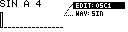
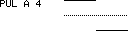
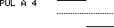
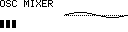

# WAV Designer

WAV Designer creates short single-cycle WAV samples for the Machinedrum UW. It has three oscillator pages and one oscillator mixer page.

Open it with:

**[Bank Group] + [Trig 10]**

## Workflow

1. Shape oscillators on `OSC1`, `OSC2` and `OSC3`.
2. Balance them on the `MIXER` page.
3. Use `TRANSFER` from the menu to render `WAVE.wav`.
4. Choose the destination Machinedrum sample slot in the Sample Manager slot picker.

WAV Designer renders a mono WAV, detects loop points, normalizes the result to full level, writes the loop metadata, and sends the file with MIDI SDS.

## Page Menu

Hold **[Global]** to open the WAV Designer menu.

| Entry | Function |
| --- | --- |
| `EDIT` | Switch between `OSC1`, `OSC2`, `OSC3` and `MIXER`. |
| `WAV` | Select the oscillator waveform on oscillator pages. |
| `TRANSFER` | Render and send the mixed waveform from the mixer page. |

`TRANSFER` is available from the mixer page.

## Oscillator Pages

Each oscillator has its own pitch, fine tune, shape width and waveform-specific editor.

| Control | Function |
| --- | --- |
| `Encoder 1` | Pitch in note steps. |
| `Encoder 2` | Fine tune in cents. |
| `Encoder 3` | Width for triangle, pulse and saw waveforms. |
| `Encoder 4` | Edit sine overtones or user waveform points while trig keys are held. |
| **[No]** / panel **Save/No** | Toggle note display and frequency display. |
| MD **[Trig]** keys | Select sine overtones or user-waveform points for `Encoder 4` editing. |

The oscillator's displayed note/frequency determines its rendered pitch. The final render uses the lowest active oscillator as the fundamental so the combined waveform loops cleanly.

## Waveforms

| Waveform | Function |
| --- | --- |
| `--` | Oscillator off. |
| `SIN` | Sine with editable overtone levels. Hold trig keys and turn `Encoder 4` to set overtone levels. |
| `TRI` | Triangle with width control. |
| `PUL` | Pulse/square with width control. |
| `SAW` | Saw with width control. |
| `USR` | Sixteen-point user waveform. Hold trig keys and turn `Encoder 4` to edit points. |

## Mixer Page

| Control | Function |
| --- | --- |
| `Encoder 1` | Oscillator 1 level. |
| `Encoder 2` | Oscillator 2 level. |
| `Encoder 3` | Oscillator 3 level. |
| `Encoder 4` | Reserved for transfer/slot state. |
| Hold **[Global]** | Open the menu with `TRANSFER`. |

The mixer levels do not need to be conservative. The rendered file is normalized before transfer, with headroom protection during rendering.

## Output File

WAV Designer writes its render to the logical path:

`/Samples/WAV/WAVE.wav`

On non-AVR builds with an initialized `/MCL` root folder, this is stored as `/MCL/Samples/WAV/WAVE.wav`.

The generated WAV includes loop metadata. If the file already exists, the render path overwrites the temporary WavDesigner output before transfer.
